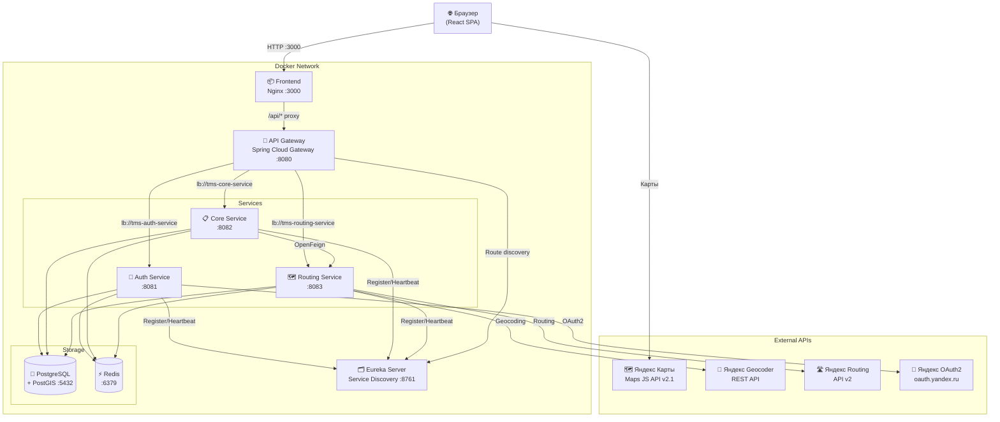
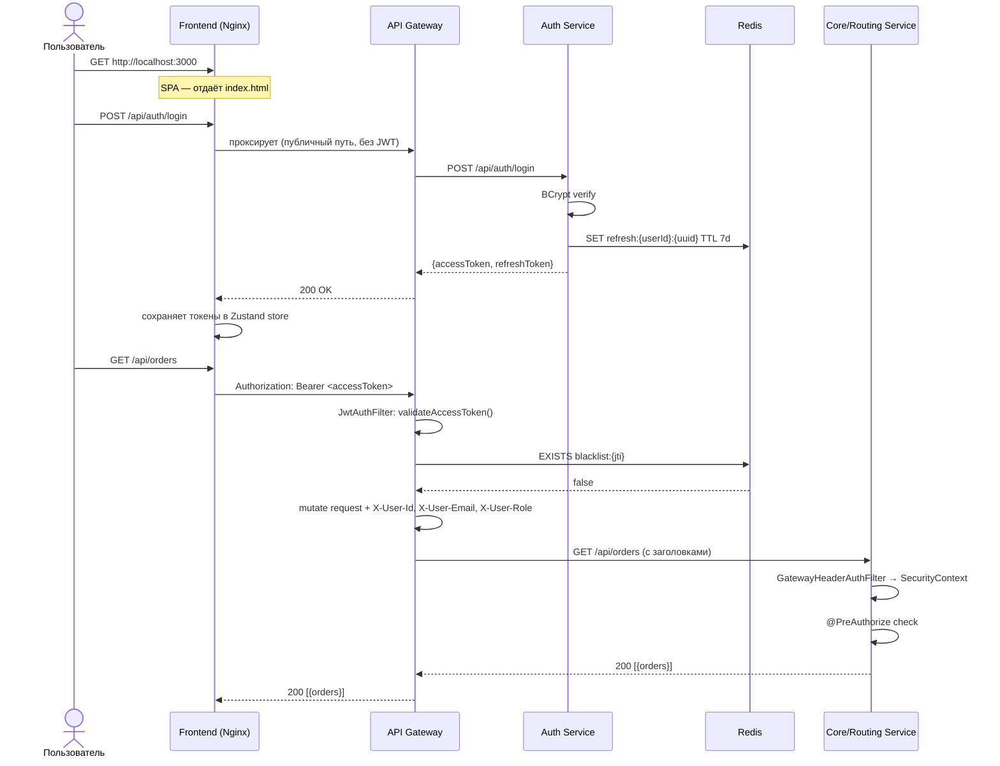
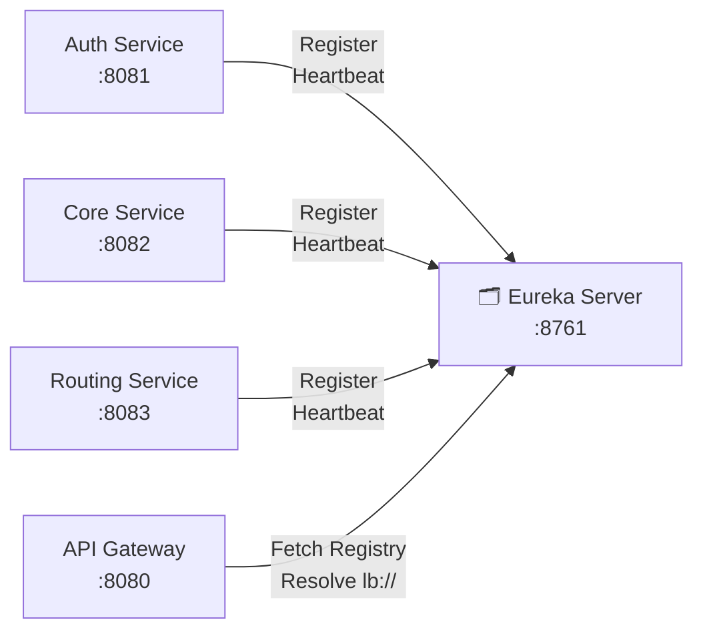
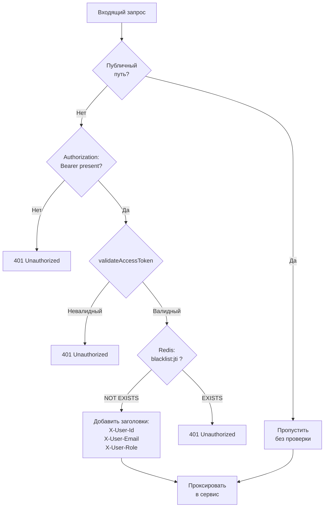
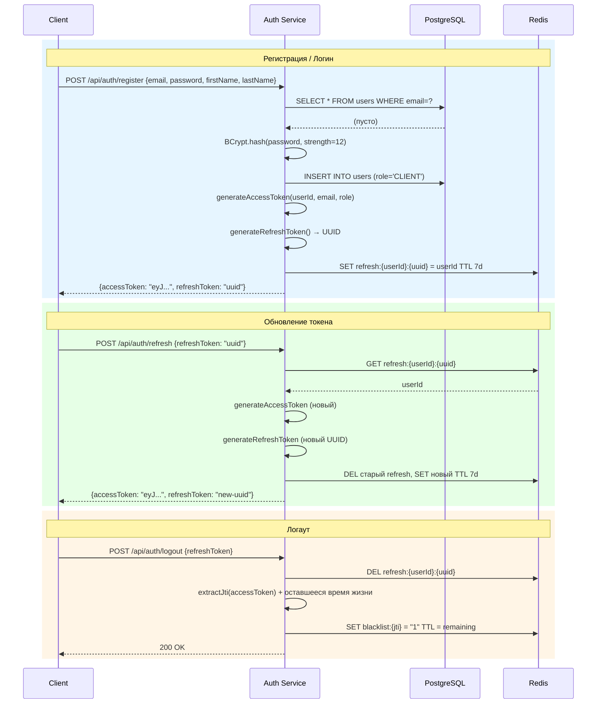
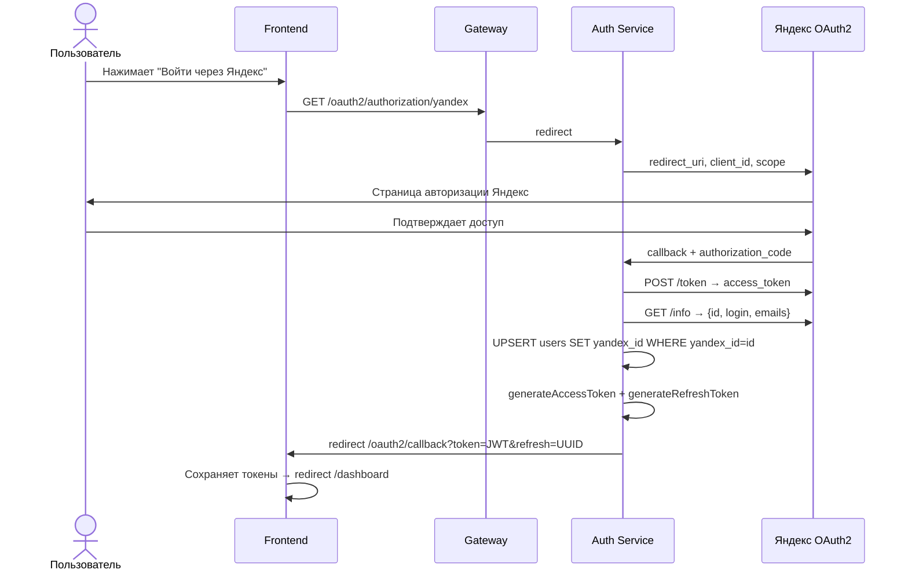
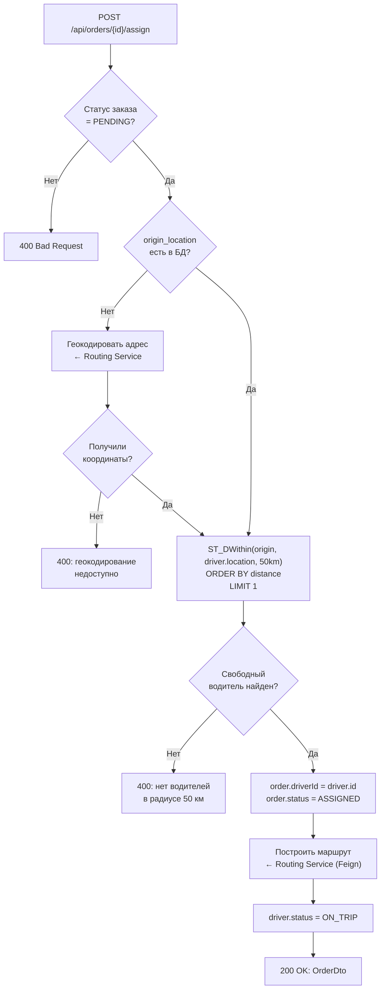
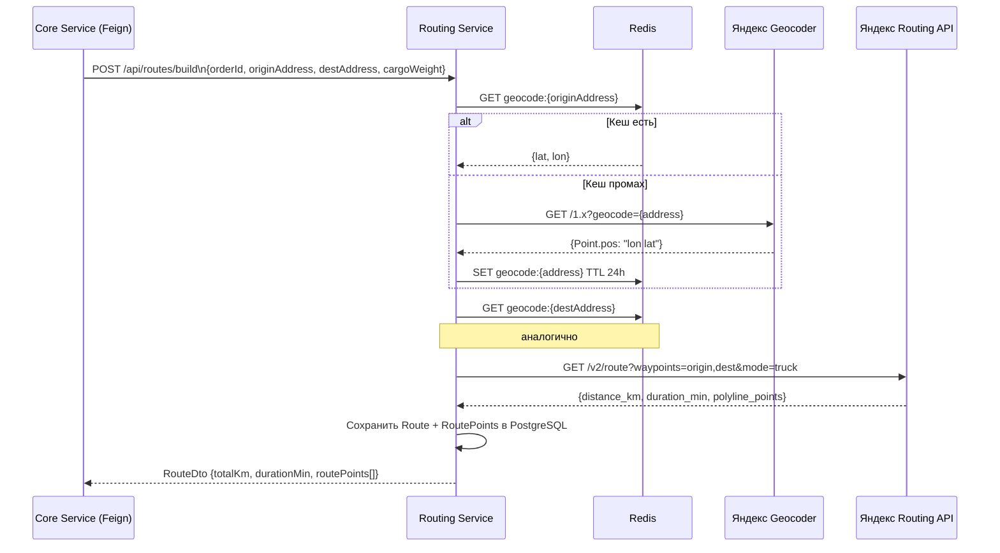
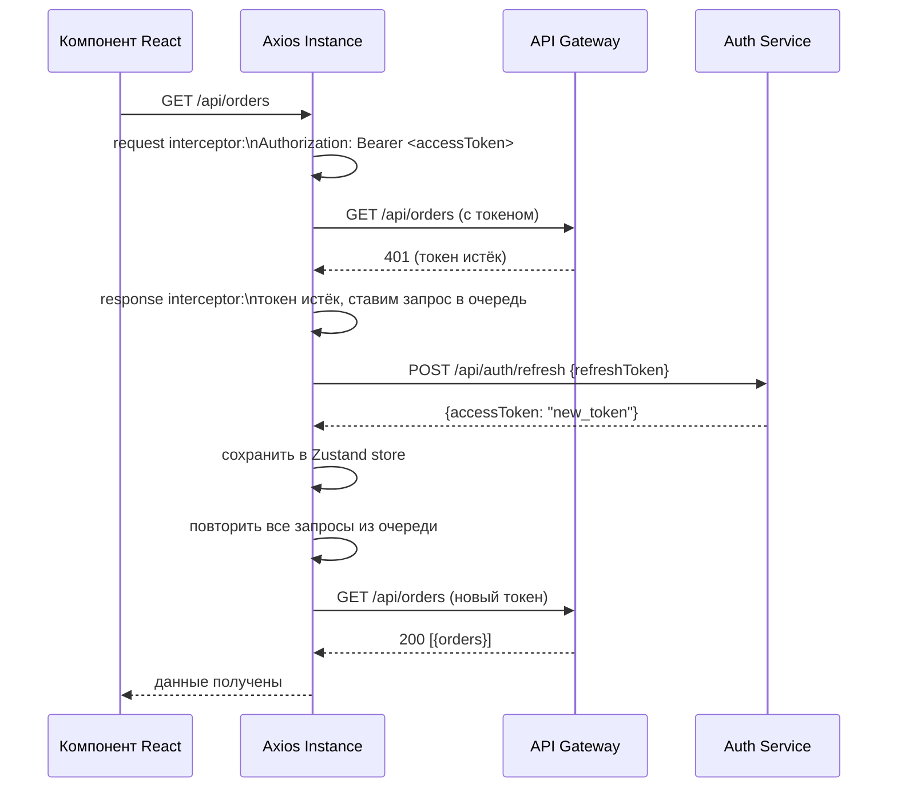
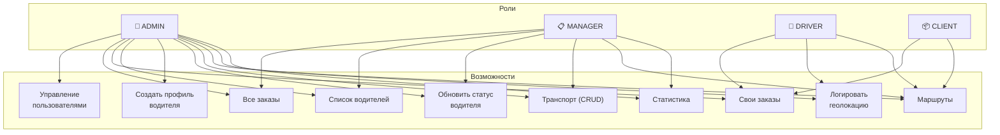

# TransLogix — Система управления транспортной компанией (TMS)

<p align="center">
  
  
  
  
  
  
</p>

---

## Содержание

1. [О проекте](#1-о-проекте)
2. [Технологический стек](#2-технологический-стек)
3. [Архитектура системы](#3-архитектура-системы)
4. [Микросервисы](#4-микросервисы)
   - [Eureka Server](#41-eureka-server--service-discovery)
   - [API Gateway](#42-api-gateway)
   - [Auth Service](#43-auth-service--аутентификация)
   - [Core Service](#44-core-service--бизнес-логика)
   - [Routing Service](#45-routing-service--маршрутизация)
   - [Frontend](#46-frontend--react--vite)
5. [База данных](#5-база-данных)
6. [Ролевая модель](#6-ролевая-модель-rbac)
7. [Redis — использование кеша](#7-redis--использование-кеша)
8. [Запуск проекта](#8-запуск-проекта)
9. [Переменные окружения](#9-переменные-окружения)
10. [API Reference](#10-api-reference)

---

## 1. О проекте

**TransLogix** — полнофункциональная платформа для управления транспортной компанией: от приёма заявок до автоматического построения маршрутов и отслеживания рейсов в реальном времени.

### Что умеет система

| Возможность | Описание |
|---|---|
| **Управление заказами** | Создание, назначение, отслеживание статуса перевозок |
| **Автоматическое назначение** | Поиск ближайшего свободного водителя через PostGIS |
| **Построение маршрутов** | Интеграция с Яндекс Routing API — дистанция, время, путевые точки |
| **Геокодирование** | Перевод адресов в координаты через Яндекс Geocoder API |
| **Отслеживание** | Логирование GPS-координат водителей, партицированная таблица |
| **Аутентификация** | Email/пароль + OAuth2 через Яндекс ID |
| **Карта** | Интерактивная карта маршрутов на Яндекс Картах v2.1 |
| **Аналитика** | Дашборды по заказам, водителям и загрузке флота |

### Роли пользователей

- **ADMIN** — полный доступ: управление всеми сущностями и пользователями
- **MANAGER** — управление заказами, водителями, транспортом
- **DRIVER** — просмотр своих рейсов, обновление геолокации
- **CLIENT** — создание заказов, отслеживание своих перевозок

---

## 2. Технологический стек

### Backend

| Слой | Технология | Версия |
|---|---|---|
| Язык | Java | 17 |
| Фреймворк | Spring Boot | 3.1.x |
| Облачная платформа | Spring Cloud (Netflix OSS) | 2022.0.x |
| Service Discovery | Netflix Eureka | — |
| API Gateway | Spring Cloud Gateway (WebFlux) | — |
| Аутентификация | Spring Security + JWT (JJWT 0.11.5) | — |
| OAuth2 | Spring Security OAuth2 Client (Яндекс) | — |
| ORM | Spring Data JPA + Hibernate Spatial | — |
| БД | PostgreSQL + PostGIS | 15 / 3.3 |
| Кеш / Брокер | Redis | 7.2 |
| Межсервисные запросы | OpenFeign | — |
| HTTP клиент (routing) | Spring RestClient | — |
| Сборка | Maven (multi-module) | — |
| Контейнеризация | Docker + Docker Compose | — |

### Frontend

| Слой | Технология | Версия |
|---|---|---|
| UI-фреймворк | React | 18.3 |
| Сборщик | Vite | 5.3 |
| Стилизация | Tailwind CSS | 3.4 |
| Маршрутизация | React Router | 6.24 |
| Состояние | Zustand | 4.5 |
| HTTP клиент | Axios (с interceptors) | 1.7 |
| Анимации | Framer Motion | 11.3 |
| Графики | Recharts | 2.12 |
| Иконки | Lucide React | 0.414 |
| Карты | Яндекс Карты JS API | 2.1 |
| Web-сервер | Nginx | 1.25 |

### Инфраструктура

- **Docker Compose** — оркестрация всех сервисов
- **PostGIS** — геопространственные индексы и запросы (`ST_DWithin`, `GIST`)
- **Partitioned tables** — логи геолокации водителей разбиты по месяцам

---

## 3. Архитектура системы

Система построена по принципу **микросервисной архитектуры**. Все сервисы регистрируются в Eureka, взаимодействуют через API Gateway, а общий код вынесен в библиотеку `tms-common-lib`.



### Поток запроса через систему



---

## 4. Микросервисы

### 4.1 Eureka Server — Service Discovery

**Порт:** `8761`  
**Назначение:** Центральный реестр сервисов. Все микросервисы при старте регистрируются здесь и обновляют статус каждые 30 секунд. Gateway использует Eureka для балансировки нагрузки (`lb://`).



**Dashboard:** `http://localhost:8761` — визуальный реестр всех зарегистрированных экземпляров.

---

### 4.2 API Gateway

**Порт:** `8080`  
**Технология:** Spring Cloud Gateway (реактивный, WebFlux)  
**Назначение:** Единая точка входа. Валидирует JWT, проверяет Redis-blacklist и проксирует запросы в нужный сервис.

#### Таблица маршрутов

| Путь | Сервис | Публичный |
|---|---|---|
| `POST /api/auth/login` | tms-auth-service | ✅ |
| `POST /api/auth/register` | tms-auth-service | ✅ |
| `POST /api/auth/refresh` | tms-auth-service | ✅ |
| `/api/auth/**` | tms-auth-service | ❌ JWT |
| `/oauth2/**`, `/login/oauth2/**` | tms-auth-service | ✅ |
| `/api/orders/**` | tms-core-service | ❌ JWT |
| `/api/drivers/**` | tms-core-service | ❌ JWT |
| `/api/vehicles/**` | tms-core-service | ❌ JWT |
| `/api/stats/**` | tms-core-service | ❌ JWT |
| `/api/routes/**` | tms-routing-service | ❌ JWT |

#### Работа JWT-фильтра (JwtAuthenticationFilter)



После успешной валидации в запрос добавляются три заголовка, которые downstream-сервисы используют для авторизации:

```
X-User-Id:    42
X-User-Email: user@example.com
X-User-Role:  MANAGER
```

---

### 4.3 Auth Service — Аутентификация

**Порт:** `8081`  
**БД:** таблица `users` в PostgreSQL  
**Назначение:** Управление пользователями, выдача JWT-токенов, OAuth2 через Яндекс.

#### Полный поток аутентификации



#### OAuth2 — Яндекс ID



#### JWT структура токена

```
Header: { "alg": "HS256", "typ": "JWT" }

Payload: {
  "sub": "42",           ← userId
  "email": "u@mail.ru",
  "role": "MANAGER",
  "jti": "uuid",         ← уникальный ID для blacklist
  "iat": 1714500000,
  "exp": 1714500900      ← +15 минут
}
```

#### Endpoints

| Метод | Путь | Доступ | Описание |
|---|---|---|---|
| `POST` | `/api/auth/register` | Public | Регистрация |
| `POST` | `/api/auth/login` | Public | Логин |
| `POST` | `/api/auth/refresh` | Public | Обновить токен |
| `POST` | `/api/auth/logout` | JWT | Выйти |
| `GET` | `/api/auth/me` | JWT | Текущий пользователь |
| `GET` | `/api/auth/admin/users` | ADMIN | Список пользователей |
| `POST` | `/api/auth/admin/users` | ADMIN | Создать пользователя |
| `DELETE` | `/api/auth/admin/users/{id}` | ADMIN | Удалить пользователя |

---

### 4.4 Core Service — Бизнес-логика

**Порт:** `8082`  
**БД:** таблицы `orders`, `drivers`, `vehicles`, `locations_log`  
**Назначение:** Управление заказами, водителями, транспортом. Автоматическое назначение водителя на заказ с геопоиском через PostGIS.

#### Логика назначения водителя



#### GatewayHeaderAuthFilter (Core/Routing Service)

Все downstream-сервисы используют одинаковый механизм: читают заголовки от Gateway и строят `SecurityContext` без повторной валидации JWT.

```java
// GatewayHeaderAuthFilter.java
String role = request.getHeader("X-User-Role"); // "MANAGER"
new SimpleGrantedAuthority("ROLE_" + role);      // → "ROLE_MANAGER"
// Теперь @PreAuthorize("hasRole('MANAGER')") работает
```

#### Endpoints

| Метод | Путь | Роли | Описание |
|---|---|---|---|
| `POST` | `/api/orders` | ADMIN, MANAGER, CLIENT | Создать заказ |
| `GET` | `/api/orders` | ADMIN, MANAGER | Все заказы |
| `GET` | `/api/orders/my` | CLIENT | Заказы клиента |
| `GET` | `/api/orders/{id}` | authenticated | Заказ по ID |
| `PATCH` | `/api/orders/{id}/status` | ADMIN, MANAGER, DRIVER | Обновить статус |
| `POST` | `/api/orders/{id}/assign` | ADMIN, MANAGER | Назначить водителя |
| `DELETE` | `/api/orders/{id}` | ADMIN, MANAGER | Удалить заказ |
| `GET` | `/api/drivers` | ADMIN, MANAGER | Все водители |
| `POST` | `/api/drivers` | ADMIN | Создать профиль водителя |
| `PATCH` | `/api/drivers/{id}/status` | ADMIN, MANAGER | Статус водителя |
| `POST` | `/api/drivers/{id}/location` | DRIVER | Обновить геолокацию |
| `GET` | `/api/vehicles` | ADMIN, MANAGER | Транспорт |
| `POST` | `/api/vehicles` | ADMIN | Создать ТС |
| `PUT` | `/api/vehicles/{id}` | ADMIN | Обновить ТС |
| `DELETE` | `/api/vehicles/{id}` | ADMIN | Удалить ТС |
| `GET` | `/api/stats/summary` | ADMIN, MANAGER | Сводная статистика |

---

### 4.5 Routing Service — Маршрутизация

**Порт:** `8083`  
**БД:** таблицы `routes`, `route_points`  
**Назначение:** Геокодирование адресов, построение маршрутов через Яндекс API, кеширование результатов в Redis.



#### Endpoints

| Метод | Путь | Описание |
|---|---|---|
| `POST` | `/api/routes/build` | Построить маршрут для заказа |
| `GET` | `/api/routes/{orderId}` | Маршрут по ID заказа |
| `POST` | `/api/routes/geocode` | Геокодировать адрес → координаты |

---

### 4.6 Frontend — React + Vite

**Порт:** `3000`  
**Развёртывание:** Nginx отдаёт статику SPA и проксирует `/api/*` → Gateway.

#### Структура приложения

```
src/
├── api/           # Axios-клиенты для каждого сервиса
├── components/    # Layout, Navbar, StatusBadge, RouteMap
├── pages/         # LandingPage, DashboardPage, OrdersPage...
├── router/        # AppRouter + PrivateRoute (RBAC)
└── store/         # Zustand: authStore, ordersStore
```

#### Механизм обновления токена (Axios interceptors)



#### Маршруты и доступ

| Путь | Компонент | Роли |
|---|---|---|
| `/` | LandingPage | Все |
| `/login` | LoginPage | Все |
| `/register` | RegisterPage | Все |
| `/oauth2/callback` | OAuth2CallbackPage | Все |
| `/dashboard` | DashboardPage | Authenticated |
| `/orders` | OrdersPage | ADMIN, MANAGER, CLIENT, DRIVER |
| `/orders/:id` | OrderDetailPage | Authenticated |
| `/drivers` | DriversPage | ADMIN, MANAGER |
| `/vehicles` | VehiclesPage | ADMIN, MANAGER |
| `/map` | MapPage | Authenticated |
| `/admin/users` | UsersPage | ADMIN |
| `/admin/dispatchers` | UsersPage (MANAGER) | ADMIN |

---

## 5. База данных

Все сервисы используют одну базу данных **PostgreSQL 15 + PostGIS 3.3** (`tms_db`). Схема логически разделена по сервисам, но физически находится в одной БД.

### Таблицы

| Таблица | Сервис | Назначение |
|---|---|---|
| `users` | Auth | Аккаунты пользователей |
| `vehicles` | Core | Транспортные средства |
| `drivers` | Core | Профили водителей |
| `orders` | Core | Заказы на перевозку |
| `routes` | Routing | Маршруты |
| `route_points` | Routing | Точки маршрута |
| `locations_log` | Core | История GPS-координат (партиционирована) |

### Описание колонок

#### `users`
| Колонка | Тип | Описание |
|---|---|---|
| `id` | BIGSERIAL PK | |
| `email` | VARCHAR(255) UNIQUE NOT NULL | |
| `password` | VARCHAR(255) | NULL для OAuth2-пользователей |
| `first_name` | VARCHAR(100) NOT NULL | |
| `last_name` | VARCHAR(100) NOT NULL | |
| `role` | VARCHAR(50) DEFAULT 'CLIENT' | ADMIN / MANAGER / DRIVER / CLIENT |
| `yandex_id` | VARCHAR(255) UNIQUE | Для Яндекс OAuth2 |
| `created_at` | TIMESTAMP DEFAULT NOW() | |

#### `vehicles`
| Колонка | Тип | Описание |
|---|---|---|
| `id` | BIGSERIAL PK | |
| `plate_number` | VARCHAR(20) UNIQUE NOT NULL | Гос. номер |
| `model` | VARCHAR(100) NOT NULL | |
| `cargo_type` | VARCHAR(50) | Тип груза |
| `max_weight` | NUMERIC(10,2) | Максимальная загрузка, кг |
| `max_volume` | NUMERIC(10,2) | Максимальный объём, м³ |
| `status` | VARCHAR(50) DEFAULT 'AVAILABLE' | AVAILABLE / IN_USE / MAINTENANCE |

#### `drivers`
| Колонка | Тип | Описание |
|---|---|---|
| `id` | BIGSERIAL PK | |
| `user_id` | BIGINT UNIQUE NOT NULL | Ссылка на `users.id` |
| `vehicle_id` | BIGINT FK → vehicles | Назначенное ТС |
| `license_no` | VARCHAR(50) UNIQUE NOT NULL | Номер ВУ |
| `status` | VARCHAR(50) DEFAULT 'AVAILABLE' | AVAILABLE / ON_TRIP / OFF_DUTY |

#### `orders`
| Колонка | Тип | Описание |
|---|---|---|
| `id` | BIGSERIAL PK | |
| `client_id` | BIGINT NOT NULL | Ссылка на `users.id` |
| `driver_id` | BIGINT FK → drivers | Назначенный водитель |
| `origin_address` | TEXT NOT NULL | Адрес отправления |
| `dest_address` | TEXT NOT NULL | Адрес назначения |
| `origin_location` | geometry(Point, 4326) | Координаты отправления (WGS84) |
| `dest_location` | geometry(Point, 4326) | Координаты назначения (WGS84) |
| `cargo_weight` | NUMERIC(10,2) | Вес груза, кг |
| `cargo_volume` | NUMERIC(10,2) | Объём груза, м³ |
| `status` | VARCHAR(50) DEFAULT 'PENDING' | PENDING / ASSIGNED / IN_PROGRESS / DELIVERED / CANCELLED |
| `created_at` | TIMESTAMP DEFAULT NOW() | |
| `updated_at` | TIMESTAMP DEFAULT NOW() | |

#### `routes`
| Колонка | Тип | Описание |
|---|---|---|
| `id` | BIGSERIAL PK | |
| `order_id` | BIGINT UNIQUE FK → orders | |
| `total_km` | NUMERIC(10,2) | Общая дистанция |
| `duration_min` | INTEGER | Время в пути, мин |
| `status` | VARCHAR(50) DEFAULT 'PLANNED' | PLANNED / ACTIVE / COMPLETED |
| `created_at` | TIMESTAMP DEFAULT NOW() | |

#### `route_points`
| Колонка | Тип | Описание |
|---|---|---|
| `id` | BIGSERIAL PK | |
| `route_id` | BIGINT FK → routes | |
| `seq_number` | INTEGER | Порядковый номер точки |
| `address` | TEXT | Текстовый адрес |
| `location` | geometry(Point, 4326) | Координаты |
| `point_type` | VARCHAR(50) | ORIGIN / WAYPOINT / DESTINATION |

#### `locations_log` (партиционирована по месяцам)
| Колонка | Тип | Описание |
|---|---|---|
| `id` | BIGSERIAL | |
| `driver_id` | BIGINT NOT NULL | |
| `location` | geometry(Point, 4326) NOT NULL | GPS-точка |
| `recorded_at` | TIMESTAMP DEFAULT NOW() | Используется для партиции |

Партиции создаются на каждый месяц, что обеспечивает эффективное хранение и удаление исторических данных.

### ER-диаграмма

```mermaid
erDiagram
    users {
        bigserial id PK
        varchar email UK
        varchar password
        varchar first_name
        varchar last_name
        varchar role
        varchar yandex_id UK
        timestamp created_at
    }

    vehicles {
        bigserial id PK
        varchar plate_number UK
        varchar model
        varchar cargo_type
        numeric max_weight
        numeric max_volume
        varchar status
    }

    drivers {
        bigserial id PK
        bigint user_id UK
        bigint vehicle_id FK
        varchar license_no UK
        varchar status
    }

    orders {
        bigserial id PK
        bigint client_id
        bigint driver_id FK
        text origin_address
        text dest_address
        geometry origin_location
        geometry dest_location
        numeric cargo_weight
        numeric cargo_volume
        varchar status
        timestamp created_at
        timestamp updated_at
    }

    routes {
        bigserial id PK
        bigint order_id UK FK
        numeric total_km
        integer duration_min
        varchar status
        timestamp created_at
    }

    route_points {
        bigserial id PK
        bigint route_id FK
        integer seq_number
        text address
        geometry location
        varchar point_type
    }

    locations_log {
        bigserial id
        bigint driver_id
        geometry location
        timestamp recorded_at
    }

    users ||--o{ drivers : "user_id (логическая FK)"
    users ||--o{ orders : "client_id (логическая FK)"
    vehicles ||--o| drivers : "vehicle_id"
    drivers ||--o{ orders : "driver_id"
    orders ||--o| routes : "order_id"
    routes ||--o{ route_points : "route_id"
    drivers ||--o{ locations_log : "driver_id (логическая FK)"
```

> **Примечание:** Связи `users → drivers`, `users → orders`, `drivers → locations_log` — **логические** (без FK в БД). Это осознанное решение микросервисной архитектуры: `users` живёт в Auth Service, остальные таблицы — в Core Service. Физические FK пересекали бы границы сервисов.

---

## 6. Ролевая модель (RBAC)



### Матрица доступа к API

| Endpoint | ADMIN | MANAGER | DRIVER | CLIENT |
|---|:---:|:---:|:---:|:---:|
| `POST /api/orders` | ✅ | ✅ | — | ✅ |
| `GET /api/orders` | ✅ | ✅ | — | — |
| `GET /api/orders/my` | — | — | ✅ | ✅ |
| `PATCH /api/orders/{id}/status` | ✅ | ✅ | ✅ | — |
| `POST /api/orders/{id}/assign` | ✅ | ✅ | — | — |
| `GET /api/drivers` | ✅ | ✅ | — | — |
| `POST /api/drivers` | ✅ | — | — | — |
| `POST /api/drivers/{id}/location` | — | — | ✅ | — |
| `GET /api/vehicles` | ✅ | ✅ | — | — |
| `POST/PUT/DELETE /api/vehicles` | ✅ | — | — | — |
| `GET /api/routes/{orderId}` | ✅ | ✅ | ✅ | ✅ |
| `GET /api/stats/summary` | ✅ | ✅ | — | — |
| `GET /api/auth/admin/users` | ✅ | — | — | — |

---

## 7. Redis — использование кеша

| Назначение | Ключ | TTL | Сервис |
|---|---|---|---|
| Refresh-токены | `refresh:{userId}:{uuid}` | 7 дней | Auth |
| JWT-blacklist (logout) | `blacklist:{jti}` | Остаток жизни токена | Auth / Gateway |
| Кеш геокодирования | `geocode:{address}` | 24 часа | Routing |
| Кеш маршрутов | `route:{hash}` | 1 час | Routing |

---

## 8. Запуск проекта

### Требования

- Docker Desktop 24+
- 4 GB RAM доступно для Docker

### Быстрый старт

```bash
# 1. Склонируйте репозиторий
git clone <repo-url>
cd Transport_company

# 2. Создайте файл .env
cp .env.example .env
# Заполните переменные (см. раздел 9)

# 3. Запустите все сервисы
docker compose up -d --build

# 4. Проверьте статус
docker compose ps
```

### Проверка готовности

| Сервис | URL | Ожидаемый результат |
|---|---|---|
| Frontend | http://localhost:3000 | Лендинг TransLogix |
| Eureka Dashboard | http://localhost:8761 | Все 4 сервиса зарегистрированы |
| Gateway Health | http://localhost:8080/actuator/health | `{"status":"UP"}` |
| Auth Health | http://localhost:8081/actuator/health | `{"status":"UP"}` |

### Первый вход

Дефолтная учётная запись администратора:

```
Email:    admin@tms.ru
Пароль:   Admin@123
```

### Пересборка отдельного сервиса

```bash
# Пересобрать и перезапустить только фронтенд
docker compose build frontend
docker compose up -d --no-build frontend

# Пересобрать core-service
docker compose build core-service
docker compose up -d --no-build core-service
```

> ⚠️ **Никогда не используйте `--no-cache`** — это инвалидирует кеш npm/Maven и увеличивает время сборки с ~1 до 25+ минут.

---

## 9. Переменные окружения

Создайте файл `.env` в корне проекта:

```env
# База данных
DB_PASSWORD=your_strong_password

# Redis
REDIS_PASSWORD=your_redis_password

# JWT (минимум 32 символа)
JWT_SECRET=your_very_long_secret_key_minimum_32_chars

# Яндекс OAuth2
YANDEX_CLIENT_ID=your_yandex_oauth_client_id
YANDEX_CLIENT_SECRET=your_yandex_oauth_client_secret

# Яндекс API
YANDEX_GEOCODER_API_KEY=your_geocoder_api_key
VITE_YANDEX_MAPS_KEY=your_maps_js_api_key

# Frontend URL (для OAuth2 callback)
FRONTEND_URL=http://localhost:3000
```

> Получить ключи Яндекс: [developer.tech.yandex.ru](https://developer.tech.yandex.ru)

---

## 10. API Reference

### Аутентификация

```bash
# Регистрация
curl -X POST http://localhost:8080/api/auth/register \
  -H "Content-Type: application/json" \
  -d '{"email":"user@mail.ru","password":"Pass123!","firstName":"Иван","lastName":"Иванов"}'

# Логин
curl -X POST http://localhost:8080/api/auth/login \
  -H "Content-Type: application/json" \
  -d '{"email":"admin@tms.ru","password":"Admin@123"}'

# Профиль текущего пользователя
curl http://localhost:8080/api/auth/me \
  -H "Authorization: Bearer <accessToken>"
```

### Заказы

```bash
# Создать заказ
curl -X POST http://localhost:8080/api/orders \
  -H "Authorization: Bearer <token>" \
  -H "Content-Type: application/json" \
  -d '{
    "originAddress": "Москва, ул. Тверская, 1",
    "destAddress": "Санкт-Петербург, Невский пр., 1",
    "cargoWeight": 1500,
    "cargoVolume": 10
  }'

# Автоматически назначить водителя
curl -X POST http://localhost:8080/api/orders/1/assign \
  -H "Authorization: Bearer <token>"

# Обновить статус
curl -X PATCH http://localhost:8080/api/orders/1/status \
  -H "Authorization: Bearer <token>" \
  -H "Content-Type: application/json" \
  -d '{"status":"IN_PROGRESS"}'
```

### Водители

```bash
# Создать профиль водителя (userId — ID из /admin/users)
curl -X POST http://localhost:8080/api/drivers \
  -H "Authorization: Bearer <adminToken>" \
  -H "Content-Type: application/json" \
  -d '{"userId": 3, "licenseNo": "77 АА 123456"}'

# Обновить геолокацию (от имени водителя)
curl -X POST http://localhost:8080/api/drivers/1/location \
  -H "Authorization: Bearer <driverToken>" \
  -H "Content-Type: application/json" \
  -d '{"lat": 55.7558, "lon": 37.6173}'
```

### Маршруты и геокодирование

```bash
# Получить маршрут заказа
curl http://localhost:8080/api/routes/1 \
  -H "Authorization: Bearer <token>"

# Геокодировать адрес
curl -X POST http://localhost:8080/api/routes/geocode \
  -H "Authorization: Bearer <token>" \
  -H "Content-Type: application/json" \
  -d '{"address": "Москва, Красная площадь"}'
```

---

## Структура репозитория

```
Transport_company/
├── pom.xml                    # Maven parent POM
├── docker-compose.yml
├── init.sql                   # Схема БД + seed данные
├── .env                       # Переменные окружения (не коммитить)
│
├── tms-common-lib/            # Общие DTO, исключения, JWT-утилиты
├── tms-eureka-server/         # Netflix Eureka (service discovery)
├── tms-api-gateway/           # Spring Cloud Gateway + JWT-фильтр
├── tms-auth-service/          # Регистрация, логин, Яндекс OAuth2
├── tms-core-service/          # Заказы, водители, транспорт
├── tms-routing-service/       # Яндекс Routing/Geocoder API
└── tms-frontend/              # React + Vite + Tailwind
```
