# ComFlow — Архитектура и потоки

Живая карта того, **как всё работает на самом деле** (по коду, не по старым докам). Читается сверху вниз: сначала общая картина, потом отдельные потоки. Диаграммы — Mermaid, GitHub рисует их автоматически.

> Обновление: 2026-06-26. Если менял поток — поправь соответствующую диаграмму.

**Что за система.** ComFlow — SaaS для автоматизации Telegram (AI-комментирование, авто-ответы в ЛС, участие в группах, прогрев аккаунтов). Работает на клиентских Telegram-аккаунтах (session+json / tdata). Продаётся через Telegram Mini App с подписками и крипто-оплатой.

**Четыре процесса** (см. `docker-compose.yml`):
| Процесс | Что делает | Точка входа |
|---|---|---|
| **API** | REST для Mini App, ×2 uvicorn-воркера | `backend.main:app` |
| **Bot** | aiogram-бот (polling), кнопка Mini App, уведомления | `bot/main_bot.py` |
| **Worker** | оркестратор + Telethon-флот аккаунтов | `workers/orchestrator.py` |
| **Frontend** | React SPA, раздаётся через nginx | `frontend/` |

Инфраструктура: **PostgreSQL** (источник правды), **Redis** (кэш/локи/heartbeat/pub-sub логов), **Kafka** (команды и события между процессами).

---

## 0. Обзор системы

Как связаны процессы и данные.

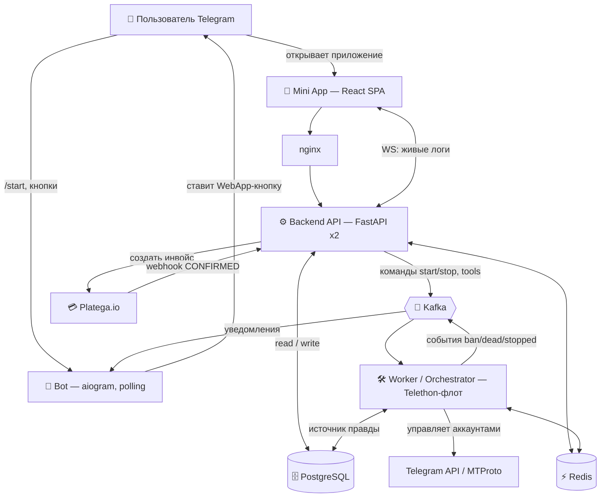

**Ключевая идея связи процессов:** PostgreSQL — единственный источник правды. Kafka — быстрый путь (мгновенная реакция), а 10-секундный поллинг воркера — страховка, которая всё сверяет и самовосстанавливается.

---

## 1. Кто что запускает

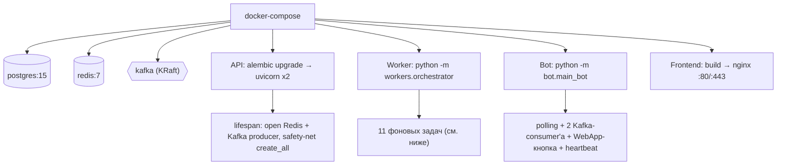

**11 задач воркера** (`workers/orchestrator.py`): `account_sync_manager` (поллинг 10с), `grace_period_manager` (час), `subscription_notifier` (час), `command_consumer` (Kafka), `comment_editor`, `scheduled_ban_check` (09:00/21:00 MSK), `digest_notifier`, `analytics_cleanup`, `warmup_finisher` (120с), `admin_broadcast_manager` (30с), `heartbeat`.

---

## 2. Запуск бота и открытие Mini App (`/start`)

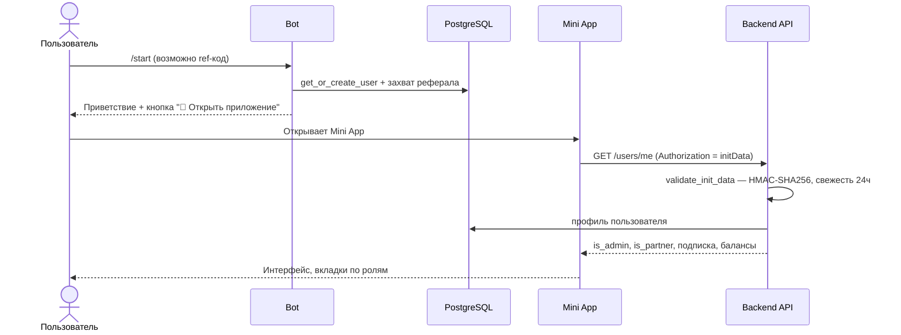

---

## 3. Жизненный цикл аккаунта

Самая важная часть продукта. Загруженный аккаунт **не идёт сразу в работу** — он проходит принудительную адаптацию.

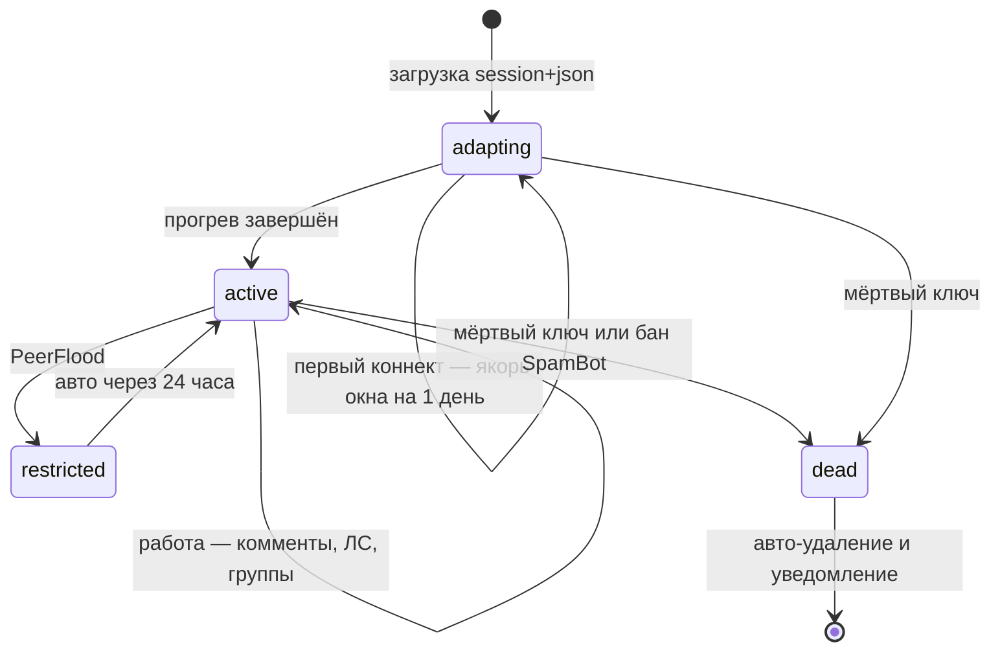

А вот как оркестратор каждые 10 секунд решает, кого запустить/остановить:

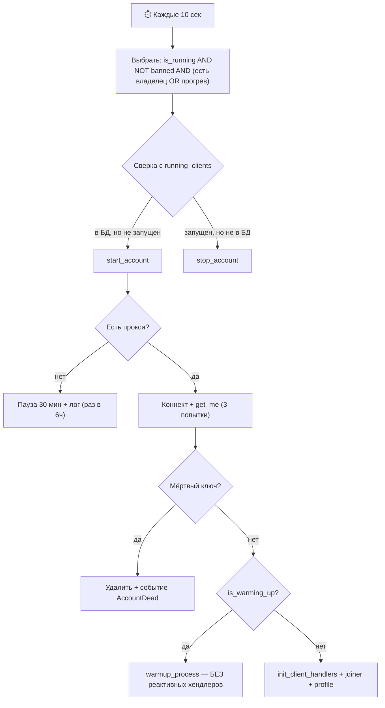

**Важно:** реактивные хендлеры (ЛС/комменты/группы) навешиваются **только в active-режиме**. Холодный/адаптирующийся аккаунт никому не отвечает.

---

## 4. Реактивная работа — как появляется комментарий / ответ

Когда аккаунт активен, на каждое входящее событие Telegram срабатывает хендлер и проходит цепочку защит.

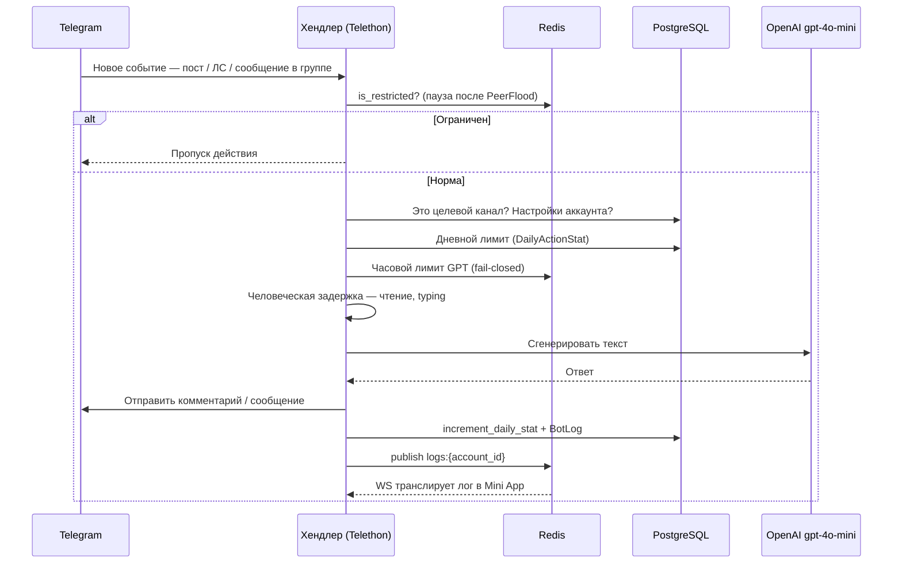

Лимиты по умолчанию: **25 каналов** и **10 групп** на аккаунт; **50 комментов/день**, **50 ЛС/день**; в группах лимита на число сообщений нет (только пауза 8–20 мин между ответами в одной группе).

---

## 5. Включение / выключение аккаунта (быстрый путь + страховка)

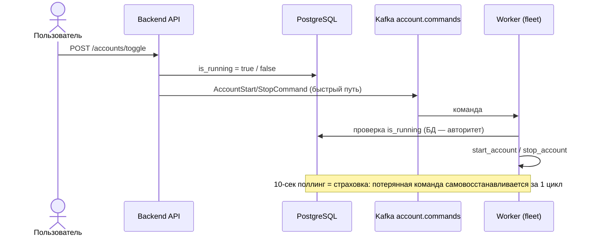

---

## 6. Оплата → подписка → выдача аккаунтов

Реально реализован **только Platega.io** (SBP / карта / крипта). Heleket/CryptoPay/Lava есть только в старых доках — в коде их нет (см. §10).

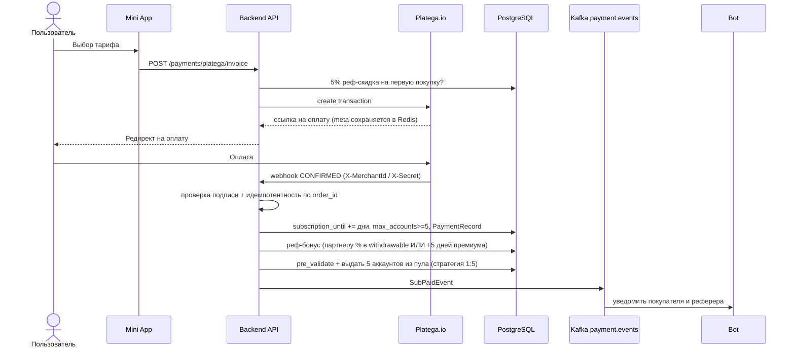

**Дальше по жизни подписки:** `subscription_notifier` шлёт предупреждения за 3 и 1 день и авто-продлевает с баланса ($49); `grace_period_manager` после истечения останавливает аккаунты, а через 7 дней возвращает пуловые аккаунты в общий пул (загруженные пользователем — не трогает).

---

## 7. Прогрев и адаптация

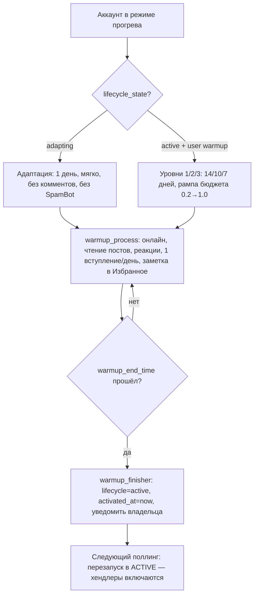

Каналы и промпт для прогрева берутся из админки (Redis `warmup:config`). **Без заданных каналов адаптация почти ничего не делает** — аккаунт просто «отлёживается» онлайн.

---

## 8. Аутентификация и права

Один заголовок `Authorization` несёт два типа credential, различаются по префиксу.

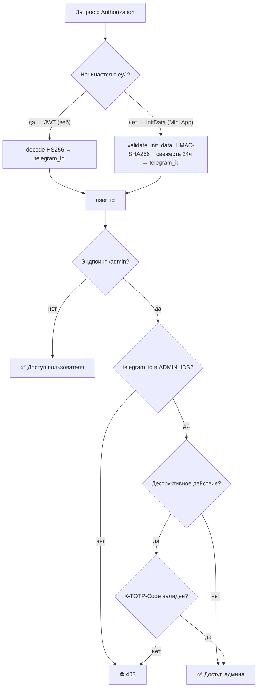

Публичные (без auth): `/health`, `/auth/telegram-login`, `/analytics/track`, `/payments/platega/rates`, webhook Platega (по подписи), `/r/{ref_code}`.

---

## 9. Kafka — топики и потоки сообщений

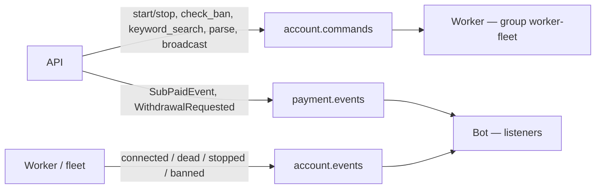

Продюсер идемпотентный (`acks=all`), консьюмер с ручным коммитом и ретраями ×3 → DLQ. `analytics.events` объявлен, но пока не используется.

---

## 10. Реальность vs документация (drift)

Что нашли при разборе — стоит однажды почистить, чтобы доки не вводили в заблуждение:

- **Платёжки:** в коде только **Platega.io**. `HELEKET_*` / `CRYPTOPAY_*` / Lava упоминаются в `CLAUDE.md` и `PROJECT_OVERVIEW.md`, но их нет в `utils/config.py` и роутерах — это legacy-доки.
- **Мёртвые страницы фронта:** `pages/Analytics.jsx` и `pages/Dashboard.jsx` импортируют Recharts, но не подключены в `router.jsx`. Живой чарт — `components/ui/AreaChartPro.jsx` (на visx), Recharts фактически не используется.
- **Устаревшие пути в `frontend/src/api/admin.js`:** `/admin/check-bans` и `/admin/bulk-bio` не совпадают с реальными `/admin/accounts/check_bans` и `/admin/warmup/bulk_bio`.
- **CLAUDE.md** говорит про 9 моделей БД и `endpoints.py` — фактически моделей больше, а эндпоинты давно разбиты по `api/routers/*`.

---

## Приложение: карта каталогов

| Путь | Что там |
|---|---|
| `bot/` | aiogram-бот: `main_bot.py`, `handlers/`, `kafka_listener.py` |
| `backend/main.py` | FastAPI-приложение, lifespan, middleware, монтирование роутеров |
| `backend/api/routers/*` | эндпоинты по доменам (см. §8/§9) |
| `backend/core/security.py` | валидация initData (HMAC) |
| `workers/orchestrator.py` | 11 фоновых задач, поллинг 10с, grace/warmup/ban-check |
| `workers/fleet.py` | старт/стоп клиентов, прокси, active-vs-warmup |
| `workers/pyrogram_engine/*` | сабворкеры: comment_generator, autoresponder, group_chat, channel_joiner, warmup_worker, account_checker, spam_checker, keyword_search, admin_broadcaster |
| `services/` | session_service, device_profiles, warmup_levels, account_limits(удалён), restriction |
| `database/models.py` `crud.py` | модели и операции БД |
| `kafka/` | producer, consumer, topics, schemas |
| `frontend/src/pages/*` | Profile, Payments, Accounts, Tools, Partner, Admin |
