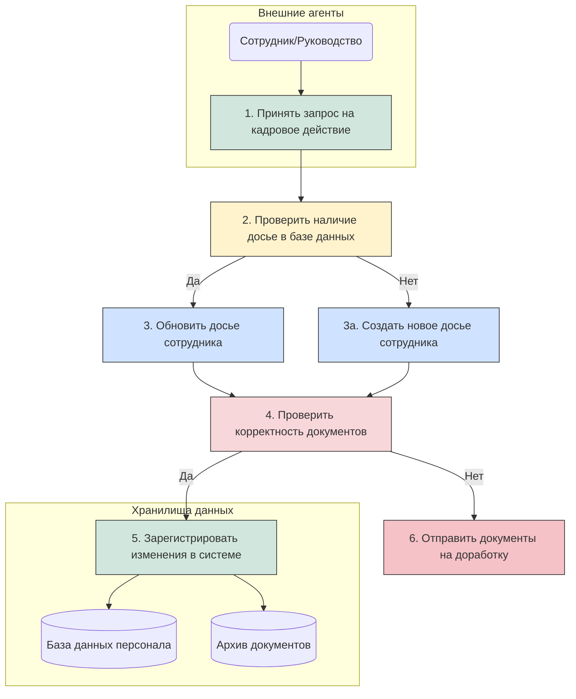

```mermaid
flowchart TD
    A[1. Принять запрос на кадровое действие] --> B[2. Проверить наличие досье в базе данных]
    B -->|Да| C[3. Обновить досье сотрудника]
    B -->|Нет| D[3а. Создать новое досье сотрудника]
    C --> E[4. Проверить корректность документов]
    D --> E

    E -->|Да| F[5. Зарегистрировать изменения в системе]
    E -->|Нет| G[6. Отправить документы на доработку]

    subgraph Внешние агенты
        X1(Сотрудник/Руководство) --> A
    end

    subgraph Хранилища данных
        DB1[(База данных персонала)]
        ARCH1[(Архив документов)]
        F --> DB1
        F --> ARCH1
    end

    style A fill:#d1e7dd,stroke:#333,stroke-width:1px
    style B fill:#fff3cd,stroke:#333,stroke-width:1px
    style C fill:#cfe2ff,stroke:#333,stroke-width:1px
    style D fill:#cfe2ff,stroke:#333,stroke-width:1px
    style E fill:#f8d7da,stroke:#333,stroke-width:1px
    style F fill:#d1e7dd,stroke:#333,stroke-width:1px
    style G fill:#f5c2c7,stroke:#333,stroke-width:1px

```
