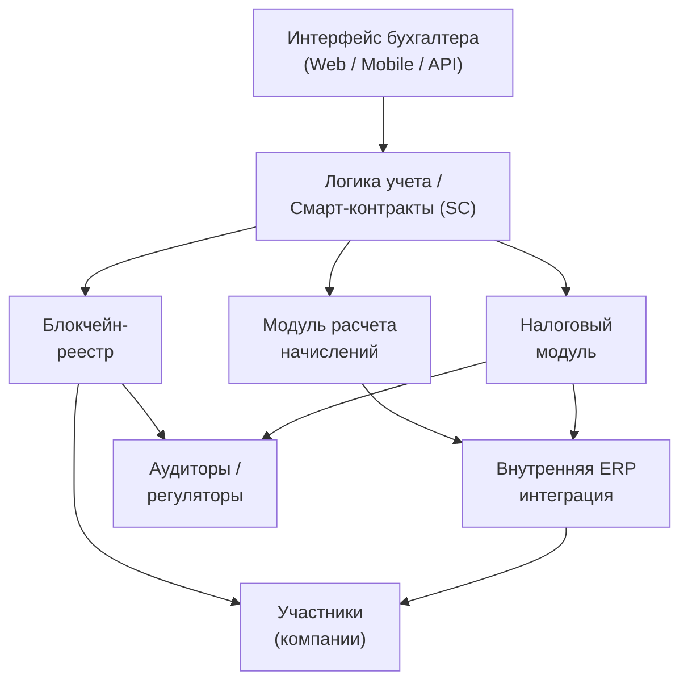

```mermaid
flowchart TD
    A["Интерфейс бухгалтера
    (Web / Mobile / API)"] --> B["Логика учета /
    Смарт-контракты (SC)"]
    B --> C["Модуль расчета
    начислений"]
    B --> D["Налоговый
    модуль"]
    C --> E["Внутренняя ERP
    интеграция"]
    D --> E
    B --> F["Блокчейн-
    реестр"]
    F --> G["Участники
    (компании)"]
    F --> H["Аудиторы /
    регуляторы"]
    E --> G
    D --> H
```
