# Stan.store — полный разбор продукта и блюпринт клона

> **Назначение документа:** реверс-инжиниринг продукта Stan (stan.store) — что это, как устроен сайт, откуда трафик, как работает воронка и монетизация — и инженерный план клона под рынок СНГ/РФ.
>
> **Дата подготовки:** 31 июля 2026
> **Целевой стек клона:** React + Vite · Zod + DTO · FastAPI · PostgreSQL · Kafka · Redis · Docker
> **Целевой рынок:** СНГ/Россия (ЮKassa, Т-Банк, СБП)
> **Скоуп MVP:** цифровые товары + курсы + бронирование звонков + подписки + email-маркетинг

---

## Оглавление

1. [TL;DR — суть за 60 секунд](#1-tldr--суть-за-60-секунд)
2. [Что такое Stan и какую боль он закрывает](#2-что-такое-stan-и-какую-боль-он-закрывает)
3. [Анатомия сайта: три разных продукта под одним доменом](#3-анатомия-сайта-три-разных-продукта-под-одним-доменом)
4. [Откуда берут трафик](#4-откуда-берут-трафик)
5. [Воронки: B2C и B2B](#5-воронки-b2c-и-b2b)
6. [Монетизация: платно / бесплатно](#6-монетизация-платно--бесплатно)
7. [Почему покупают именно у них](#7-почему-покупают-именно-у-них)
8. [Слабые места Stan = точки входа для клона](#8-слабые-места-stan--точки-входа-для-клона)
9. [Адаптация под рынок СНГ/РФ](#9-адаптация-под-рынок-снгрф)
10. [Как это работает под капотом](#10-как-это-работает-под-капотом)
11. [Архитектура клона](#11-архитектура-клона)
12. [Модель данных](#12-модель-данных)
13. [Событийная модель (Kafka)](#13-событийная-модель-kafka)
14. [Ключевые сценарии (sequence-диаграммы)](#14-ключевые-сценарии-sequence-диаграммы)
15. [Redis: где и зачем](#15-redis-где-и-зачем)
16. [Контракты: Zod + DTO](#16-контракты-zod--dto)
17. [Инфраструктура и Docker](#17-инфраструктура-и-docker)
18. [Roadmap: от нуля до первых платящих](#18-roadmap-от-нуля-до-первых-платящих)
19. [Риски и честные предупреждения](#19-риски-и-честные-предупреждения)

---

## 1. TL;DR — суть за 60 секунд

**Что продаёт Stan:** одну ссылку `stan.store/имя`, которую криэйтор ставит в био Instagram/TikTok. По ней открывается мобильная витрина, где подписчик покупает в один тап — без перехода на сторонние сервисы.

**Кому продаёт:** микро- и наноинфлюенсерам, коучам, экспертам с аудиторией 1k–100k, у которых уже есть внимание, но нет инфраструктуры для его монетизации.

**Как зарабатывает:** подписка $29/мес (Creator) или $99/мес (Creator Pro). **0% комиссии с продаж** — это ключевой маркетинговый крючок. Бесплатного тарифа нет, только 14-дневный триал.

**Главный фокус, который делает бизнес:** Stan не продаёт «конструктор ссылок». Stan продаёт **сокращение пути от клика до оплаты**. Каждый редирект между сервисами убивает 20–40% импульсных покупателей на мобильном. Stan убирает все редиректы — и берёт за это фиксированную плату.

**Главная механика роста:** витрины криэйторов сами являются каналом привлечения. Миллионы покупателей видят брендированную страницу `stan.store/...`, часть из них — сами криэйторы. Продукт растёт за счёт собственного использования.

**Ключевые цифры:**

| Метрика | Значение |
|---|---|
| MRR (верифицировано TrustMRR) | ~$3.57M |
| Активных подписок | ~101 590 |
| Лайфтайм-выручка | ~$76.6M |
| Трафик на домен | 8–10M визитов/мес |
| Основан | апрель 2023 (юрлицо), продукт с 2020 |
| Ahrefs Domain Rating | 89/100 |

**ARPU:** $3.57M ÷ 101 590 ≈ **$35/мес** — то есть основная масса на тарифе $29, доля Pro невелика. Это важный ориентир для юнит-экономики клона.

---

## 2. Что такое Stan и какую боль он закрывает

### 2.1. Проблема «стека из пяти сервисов»

До Stan типичный криэйтор, который хотел продать гайд за 2000 рублей, собирал:

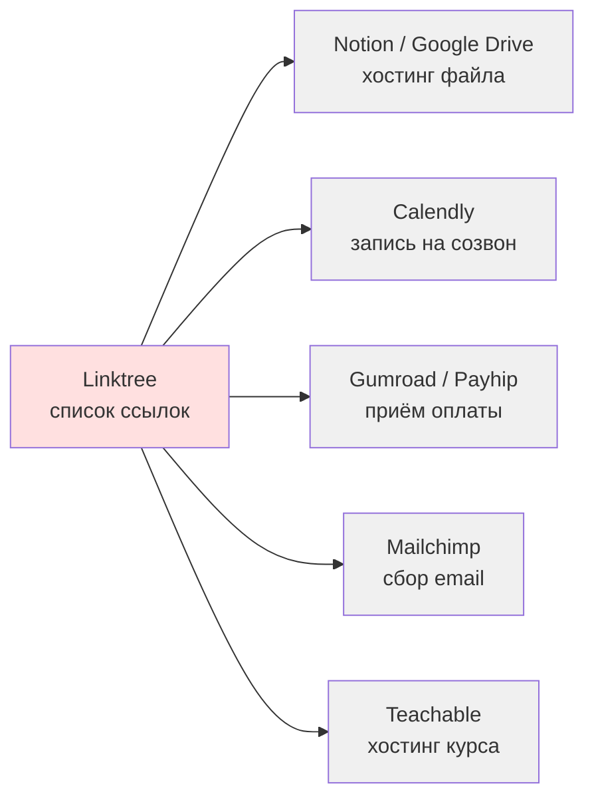

**Что здесь ломается:**

| Проблема | Последствие |
|---|---|
| 3–4 редиректа до оплаты | Потеря 30–50% импульсного трафика |
| Разные UX и дизайн на каждом шаге | Падает доверие, растёт «а это точно не скам?» |
| Комиссии на каждом сервисе (5–10%) | При $3k/мес выручки — $150–300 уходит впустую |
| Данные о клиенте размазаны по 5 системам | Невозможно строить повторные продажи |
| Настройка занимает 2–3 дня | Большинство просто не доходит до первой продажи |

### 2.2. Решение Stan

Одна страница, один чекаут, одна база клиентов, один дашборд.

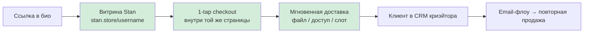

### 2.3. Что можно продавать

| Тип продукта | Что это | Тариф |
|---|---|---|
| **Цифровой товар** | PDF-гайд, шаблоны, пресеты, чек-листы — файл отдаётся сразу после оплаты | Creator |
| **Онлайн-курс** | Модули, уроки, видео, отслеживание прогресса и completion rate | Creator |
| **Бронирование звонка** | Календарь + слоты + автогенерация ссылки Zoom, буфер перед записью | Creator |
| **Подписка / membership** | Рекуррентный платёж за доступ к контенту | Creator |
| **Сообщество** | Закрытое комьюнити (ограничение: одно на магазин) | Creator |
| **Лид-магнит** | Бесплатный файл в обмен на email | Creator |
| **Вебинар** | Регистрация на мероприятие | Creator |
| **Партнёрская ссылка** | Просто внешняя ссылка с описанием и картинкой | Creator |

Ограничение, о котором стоит знать: встроенной видеосвязи нет — Stan интегрируется с Zoom, но сам звонки не проводит. Продвинутых функций курсов (экзамены, сертификаты, тесты) тоже нет.

---

## 3. Анатомия сайта: три разных продукта под одним доменом

Критично для понимания: `stan.store` — это **не один сайт**, а три разные системы с разной аудиторией, разной нагрузкой и разными требованиями.

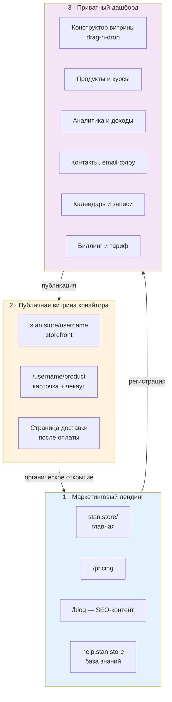

### 3.1. Маркетинговый лендинг

**Задача:** превратить криэйтора в триал. Стандартные элементы: hero с обещанием заработка, соцдоказательства (кейсы криэйторов с суммами), сравнения с Linktree/Beacons, блог для SEO.

Слоган, который они используют в мете сайта — работа один на один с топовыми криэйторами для монетизации их бизнеса. Позиционирование намеренно «премиальное», не «сделай себе ссылочку».

### 3.2. Витрина криэйтора — самая нагруженная часть

Это **99% трафика домена**. Отсюда следует главное архитектурное требование:

> Витрина должна выдерживать миллионы просмотров в месяц, при этом дашборд — на порядки меньше. Это два разных профиля нагрузки, и их нужно масштабировать раздельно.

Технические наблюдения по публичной части Stan:
- Фронтенд — **SPA на Vue.js**: сайт отдаёт стандартный noscript-заглушку из Vue CLI boilerplate («не работает без JavaScript»). Это косвенный, но надёжный признак.
- Ассеты вынесены на отдельный CDN-домен `assets.stanwith.me`.
- Есть отдельный короткий домен `stanwith.me` — вероятно, для шортлинков и редиректов.
- Кастомные домены **не поддерживаются ни на одном тарифе** — только `stan.store/имя` или форвардинг своего домена. Это осознанное решение: каждая витрина работает бесплатной рекламой платформы.

### 3.3. Дашборд криэйтора

Разделы, которые точно есть: конструктор витрины (drag-n-drop), создание продуктов, аналитика по кликам и продажам, отдельная страница доходов (продажи, подписки на email, записи на звонки), календарь, настройки биллинга. На Pro добавляются email-флоу.

**Заявленное время от регистрации до живого магазина: 15–30 минут.** Это не маркетинг, это подтверждается независимыми обзорами. Для клона это KPI, а не пожелание.

---

## 4. Откуда берут трафик

### 4.1. Реальная структура трафика

По данным Semrush/SimilarWeb (май–август 2026):

| Источник | Доля | Комментарий |
|---|---|---|
| **Direct** | ~50% | Люди тапают ссылку в био — браузер не передаёт реферер |
| **l.instagram.com** | ~13% | Явные переходы из Instagram |
| Прочие соцсети, referral | ~20% | TikTok, YouTube, Telegram |
| Organic search | ~10% | Блог + брендовые запросы |
| Paid search | ~5% | Растёт (+111% м/м) |

Общий объём: **8–10M визитов/мес**, ядро аудитории — США (~52%), UK (~13%), Австралия, Канада, Индия. Аудитория 56% женская, ядро — 25–34 года.

> **Ключевой вывод:** ~85% трафика — это **покупатели**, а не потенциальные клиенты платформы. Stan не покупает трафик на себя. Трафик приносят сами криэйторы, а платформа его «собирает» как побочный эффект.

### 4.2. Вирусная петля — главный движок роста

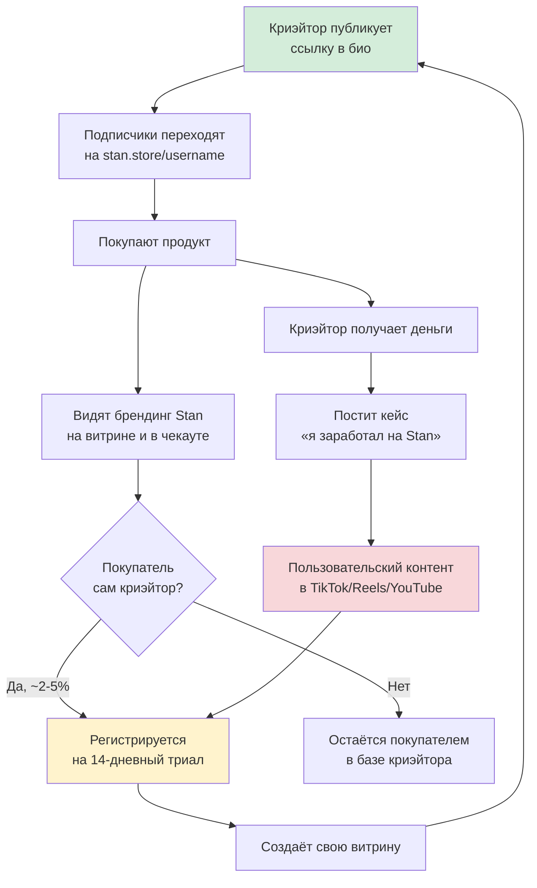

**Три усилителя петли:**

1. **Отсутствие кастомных доменов.** Каждая витрина = бесплатный билборд. Раздражает криэйторов, но это самый дешёвый канал привлечения в индустрии.
2. **Ниша «как заработать в интернете».** Огромная часть клиентов Stan продаёт курсы о том, как продавать курсы. Они органически рекламируют Stan своей аудитории — получается самовоспроизводящийся цикл.
3. **Affiliate-программа.** Пользователи получают комиссию за приведённых подписчиков платформы (у самих криэйторов на Pro есть своя функция Affiliate Share с настраиваемыми комиссиями 20–50%).

### 4.3. Остальные каналы

| Канал | Как работает |
|---|---|
| **SEO-блог** | Статьи «Stan vs Linktree», «Stan Store pricing» — перехват запросов сравнения. DR 89 позволяет ранжироваться почти по любому запросу ниши |
| **Партнёрский контент** | Десятки обзорных сайтов пишут про Stan ради affiliate-комиссии — бесплатный контент-маркетинг |
| **Инфлюенсер-маркетинг 1-на-1** | Работа с топовыми криэйторами напрямую (это буквально написано в мете их сайта) |
| **Paid search** | Растёт, но остаётся малой долей — экономически эффективнее вкладываться в петлю |
| **AutoDM** | Функция внутри продукта: подписчик пишет ключевое слово в Instagram → бот отправляет ссылку на товар. Работает как встроенный конверсионный инструмент, а заодно привязывает криэйтора к платформе |

---

## 5. Воронки: B2C и B2B

Здесь два принципиально разных пути, и путать их нельзя.

### 5.1. Воронка покупателя (B2C) — короткая и импульсная

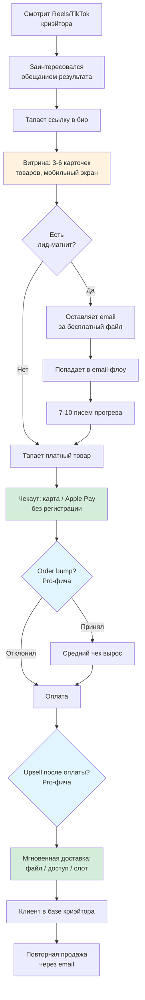

**Критические точки этой воронки:**

- **Шаг C→D — самый уязвимый.** Витрина должна открыться меньше чем за секунду на мобильном 4G. Каждые +500мс = минус конверсия. Отсюда требование: SSR/статическая генерация витрин + агрессивный CDN-кэш.
- **Шаг I→J — второй по потерям.** Регистрация перед покупкой убивает конверсию. Гостевой чекаут обязателен.
- **Шаг M→O — доверие.** Если файл не пришёл мгновенно, начинаются возвраты и жалобы. Доставка должна быть синхронной, а не «письмо придёт в течение часа».

### 5.2. Воронка криэйтора (B2B) — путь к подписке

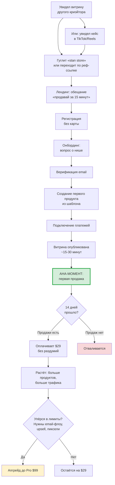

**Здесь вся экономика бизнеса сводится к одной точке — блоку `K`.**

Если криэйтор сделал первую продажу за 14 дней, он платит $29 не задумываясь: продукт уже вернул стоимость. Если не сделал — уходит навсегда.

> **Главный вывод для клона:** вся инженерная и продуктовая работа должна быть подчинена сокращению времени до первой продажи. Не «богатый функционал», а «первая продажа за 15 минут».

### 5.3. Почему Stan убрал воронки (funnels)

В феврале 2025 Stan **отключил функцию многошаговых воронок** для новых пользователей, заменив её связкой «одностраничная витрина + 1-click checkout + order bumps + upsells». Официальное объяснение: конвертирует не хуже, а настраивать в разы проще.

Это очень ценный урок для клона: **сложность настройки убивает продукт для этой аудитории**. Криэйтор — не маркетолог. Он не будет строить пятишаговую воронку. Не повторяйте эту ошибку — не стройте её вообще.

---

## 6. Монетизация: платно / бесплатно

### 6.1. Тарифная сетка (актуально на июль 2026)

| | **Триал** | **Creator** | **Creator Pro** |
|---|---|---|---|
| Цена / мес | **$0** | **$29** | **$99** |
| При годовой оплате | — | $25/мес ($300/год) | $79/мес ($948/год) |
| Экономия за год | — | $48 | $240 |
| Длительность | **14 дней** | — | — |
| Карта при старте | **не нужна** | — | — |
| Комиссия платформы | 0% | **0%** | **0%** |
| Комиссия эквайринга | ~2.9% + $0.30 (Stripe/PayPal) | то же | то же |

**Постоянного бесплатного тарифа нет.** Это принципиальное отличие от Linktree и Beacons, у которых free-план есть.

### 6.2. Что входит в каждый тариф

| Функция | Creator $29 | Creator Pro $99 |
|---|:---:|:---:|
| Витрина link-in-bio | ✅ | ✅ |
| Неограниченно цифровых товаров | ✅ | ✅ |
| Конструктор курсов + аналитика прохождения | ✅ | ✅ |
| Календарь и бронирование звонков | ✅ | ✅ |
| Рекуррентные подписки | ✅ | ✅ |
| Сообщество (1 на магазин) | ✅ | ✅ |
| Лид-магниты, сбор email | ✅ | ✅ |
| AutoDM для Instagram | ✅ | ✅ |
| Базовая аналитика магазина и продуктов | ✅ | ✅ |
| Лимит контактов | 5 000 | 20 000 |
| **Email-рассылки (broadcast)** | ❌ | ✅ |
| **Автоматические email-флоу** | ❌ | ✅ |
| **Импорт контактов** | ❌ | ✅ |
| **Upsells и order bumps** | ❌ | ✅ |
| **Промокоды** | ❌ | ✅ |
| **Динамическое ценообразование, рассрочка** | ❌ | ✅ |
| **Ограниченные по количеству офферы** | ❌ | ✅ |
| **Affiliate Share (партнёрка криэйтора)** | ❌ | ✅ |
| **Пиксели: Meta, Google, Pinterest, TikTok** | ❌ | ✅ |
| **Расширенная аналитика** | ❌ | ✅ |
| Кастомный домен | ❌ | ❌ |
| Встроенные видеозвонки | ❌ | ❌ |
| Сертификаты и экзамены в курсах | ❌ | ❌ |

### 6.3. Логика разделения тарифов

Разделение сделано не по объёму, а **по стадии зрелости бизнеса криэйтора**:

- **$29** = «начать продавать». Всё для первой продажи.
- **$99** = «выжимать больше из того же трафика». Email, upsell, ретаргетинг.

Именно поэтому самая частая претензия в обзорах — что email-маркетинг заперт на $99, хотя платформа рекламируется как all-in-one за $29. Это осознанный дизайн: email-флоу — это то, за что человек с доказанным доходом платит без торга.

### 6.4. Почему модель «0% комиссии» работает

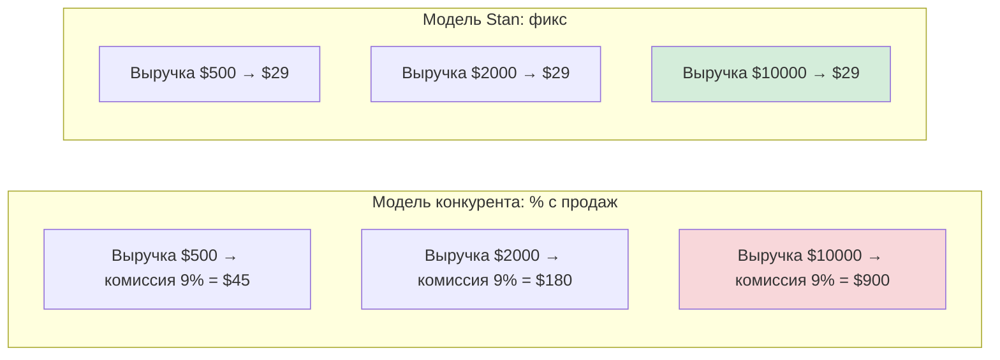

**Точка безубыточности для криэйтора:** при комиссии конкурента 9% фикс в $29 окупается уже при выручке ~$320/мес. Практически любой активно продающий криэйтор оказывается в выигрыше.

**Что это даёт Stan:**
- Предсказуемый MRR вместо волатильной комиссии
- Сильный маркетинговый месседж («оставь себе 100%»)
- Идеальное выравнивание интересов: чем больше зарабатывает криэйтор, тем сильнее он привязан
- Не нужно быть платёжным агентом со всеми регуляторными последствиями

**Обратная сторона:** платформа не растёт вместе с крупными клиентами. Криэйтор с $50k/мес платит те же $29. Отсюда нижняя граница ARPU и необходимость Pro-тарифа.

---

## 7. Почему покупают именно у них

### 7.1. Рациональные причины

| Причина | Почему это работает |
|---|---|
| **Скорость до первой продажи** | 15–30 минут против 2–3 дней на сборку стека. Главный аргумент |
| **Экономика при 0% комиссии** | При выручке от $500/мес фикс выгоднее процента |
| **Мобильная конверсия** | Витрины спроектированы под большой палец на экране 6", а не под десктоп |
| **Нулевой технический порог** | Не нужен сайт, домен, хостинг, интеграции |
| **Единая база клиентов** | Все покупатели в одном месте → возможны повторные продажи |
| **Готовые шаблоны** | Не нужно думать, как оформить — есть проверенные пресеты |

### 7.2. Иррациональные и психологические

| Фактор | Механика |
|---|---|
| **Социальное доказательство** | Ссылка `stan.store/...` стала маркером «этот человек серьёзно монетизирует». Формат узнаваем аудиторией |
| **Платность как сигнал** | Отсутствие free-плана отсекает несерьёзных и повышает воспринимаемый статус инструмента |
| **Эффект «я уже вложился»** | После $29 и потраченного вечера криэйтор психологически обязан начать продавать |
| **Кейсы «я заработал X»** | Огромное количество UGC с реальными скриншотами дохода — сильнейший триггер |
| **Простота как ценность** | Аудитория активно не хочет разбираться в Kajabi/ClickFunnels. Ограниченность Stan — это фича |

### 7.3. Что удерживает от ухода (retention)

- **База клиентов и email-лист** живут внутри платформы
- **Ссылка уже расшарена** в тысячах постов и не может быть изменена без потери трафика
- **Курсы и контент** загружены и структурированы внутри
- **Календарь и записи** привязаны к системе
- **Отсутствие кастомного домена** делает миграцию болезненной — вся накопленная «ссылочная масса» принадлежит платформе

Последний пункт — жёсткий, но крайне эффективный механизм удержания. Для клона это этическая развилка: скопировать или сделать честнее.

---

## 8. Слабые места Stan = точки входа для клона

Это самый ценный раздел для того, кто строит конкурента.

| Слабость | Возможность для клона |
|---|---|
| **Нет кастомных доменов вообще** | Дать кастомный домен на верхнем тарифе. Мощнейший аргумент для перехода |
| **Email-маркетинг только на $99** | Дать базовые флоу уже на стартовом тарифе — снимает главную претензию рынка |
| **Нет бесплатного тарифа** | Free-план с комиссией (например, 5%) даёт вход без риска и включает вирусную петлю раньше |
| **AutoDM только Instagram, только один шаг** | Telegram-бот с ветвлением — для СНГ это в разы актуальнее |
| **Нет встроенных видеозвонков** | Интеграция с российскими решениями или собственный WebRTC |
| **Слабые курсы: нет тестов, сертификатов** | Полноценный LMS-слой закрывает целый сегмент инфобиза |
| **Шаблоны выглядят одинаково** | Реальная кастомизация дизайна как дифференциатор |
| **Только одно сообщество на магазин** | Снять ограничение |
| **Нет мультиязычности и мультивалютности** | Для СНГ — обязательное условие, не опция |
| **Функция воронок отключена** | Не повторять — но дать простые двухшаговые сценарии |

---

## 9. Адаптация под рынок СНГ/РФ

Это не «перевод интерфейса». Это переработка трёх ключевых подсистем.

### 9.1. Платежи

| Аспект | Stan (глобально) | Клон (СНГ/РФ) |
|---|---|---|
| Основной провайдер | Stripe | **ЮKassa** (широкий охват, есть рекуррент) |
| Альтернатива | PayPal | **Т-Банк (Тинькофф Касса)** |
| Мгновенный перевод | — | **СБП** — низкая комиссия (~0.4–0.7%), высокая конверсия на мобильном |
| Рассрочка | Afterpay, Klarna | **Долями, Подели, Сплит** |
| Рекуррент | Stripe Subscriptions | Автоплатежи ЮKassa / Т-Банк по сохранённому токену |
| Комиссия эквайринга | ~2.9% + $0.30 | ~2.5–3.5% карты, **~0.4–0.7% СБП** |

> **Важное архитектурное следствие:** СБП сильно дешевле карт. Стоит по умолчанию показывать СБП первым способом оплаты — это одновременно повышает конверсию и снижает издержки.

### 9.2. Юридическая схема — критическая развилка

Есть два принципиально разных пути, и выбор определяет всю архитектуру платёжного модуля:

**Вариант А — «Платформа как витрина» (рекомендуется для MVP)**

Криэйтор подключает **свой** аккаунт ЮKassa/Т-Банк. Деньги идут напрямую ему, платформа их не касается.

- ✅ Не нужна лицензия платёжного агента
- ✅ Нет обязанностей по 54-ФЗ (чеки пробивает сам криэйтор)
- ✅ Нет налогового агентирования
- ✅ Легко реализовать модель «0% комиссии»
- ❌ Порог входа выше: криэйтору нужно своё юрлицо/ИП/самозанятость и подключённая касса
- ❌ Нельзя брать процент с продаж

**Вариант Б — «Платформа как маркетплейс»**

Деньги идут на счёт платформы, затем выплачиваются криэйторам.

- ✅ Низкий порог входа для криэйтора
- ✅ Можно брать комиссию → возможен free-план
- ❌ Нужна схема маркетплейса/агентская (например, ЮKassa Сплит)
- ❌ Обязанности по 54-ФЗ, фискализация
- ❌ Возможное налоговое агентирование для самозанятых
- ❌ Заморозка выплат, риски по 115-ФЗ
- ❌ Существенно дольше и дороже в разработке

> **Рекомендация: стартовать с Варианта А**, а Вариант Б добавить как опцию позже, когда будет юридический ресурс. Это единственное решение, которое реально экономит месяцы.
>
> **Отдельно:** конкретную схему обязательно проверять с юристом до начала разработки — я даю инженерный обзор, а не юридическую консультацию.

### 9.3. Каналы трафика в СНГ

Instagram AutoDM в российских реалиях работает существенно хуже. Заменяем:

| Stan | Клон для СНГ |
|---|---|
| Instagram AutoDM | **Telegram-бот** с ключевыми словами и ветвлением |
| Instagram bio link | **Telegram bio / канал / VK / YouTube** |
| Zoom для звонков | Яндекс.Телемост, СберДжаз, Контур.Толк, VK Звонки |
| Mailchimp-стиль email | Unisender / Sendsay / собственный SMTP |
| — | **Telegram-канал как продукт** — платная подписка на закрытый канал с автовыдачей доступа |

**Telegram — главное отличие рынка.** Функция «платная подписка на закрытый Telegram-канал с автоматической выдачей и отзывом доступа» может стать киллер-фичей клона. В глобальных аналогах её нормально не делает никто.

---

## 10. Как это работает под капотом

### 10.1. Что известно о Stan (наблюдаемые факты)

Stan не публикует свою архитектуру. Достоверно наблюдаемое:

| Наблюдение | Что из этого следует |
|---|---|
| noscript-заглушка из Vue CLI boilerplate | Фронтенд — SPA на Vue.js |
| Домен `assets.stanwith.me` | Ассеты вынесены на отдельный CDN |
| Домен `stanwith.me` | Отдельный шортлинк/редирект-сервис |
| Верификация выручки через Stripe API | Stripe — основной провайдер платежей и подписок |
| Ahrefs DR 89 при SPA-архитектуре | Скорее всего SSR или пререндер для витрин |
| ~101k активных подписок, 8–10M визитов/мес | Публичные витрины отдаются из кэша, иначе БД не выдержит |

Всё остальное — обоснованный дизайн, а не факты о Stan.

### 10.2. Три профиля нагрузки

Это главная идея всей архитектуры:

| Контур | Нагрузка | Требование | Стратегия |
|---|---|---|---|
| **Публичные витрины** | Очень высокая (99% трафика) | TTFB < 200мс | Агрессивный кэш, CDN, read-only |
| **Чекаут и платежи** | Средняя, но критичная | Надёжность, идемпотентность | Транзакции, очереди, retry |
| **Дашборд криэйтора** | Низкая | Богатый функционал | Обычный CRUD |

Их нельзя обслуживать одинаково.

---

## 11. Архитектура клона

### 11.1. Общая схема

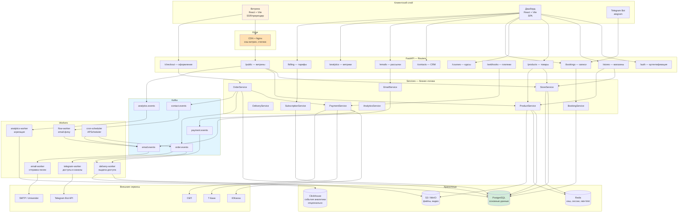

### 11.2. Структура FastAPI-проекта

```
backend/
├── app/
│   ├── main.py                    # точка входа, сборка роутеров, OpenAPI
│   ├── core/
│   │   ├── config.py              # pydantic-settings, env
│   │   ├── security.py            # JWT, хеширование паролей
│   │   ├── deps.py                # Depends: db, current_user, tenant
│   │   └── exceptions.py          # доменные исключения → HTTP
│   ├── routers/                   # ТОЛЬКО HTTP-слой
│   │   ├── public.py              # витрины, без авторизации
│   │   ├── auth.py
│   │   ├── stores.py
│   │   ├── products.py
│   │   ├── courses.py
│   │   ├── bookings.py
│   │   ├── checkout.py
│   │   ├── webhooks.py            # входящие от ЮKassa/Т-Банк
│   │   ├── contacts.py
│   │   ├── emails.py
│   │   ├── analytics.py
│   │   └── billing.py
│   ├── services/                  # ВСЯ бизнес-логика
│   │   ├── store_service.py
│   │   ├── product_service.py
│   │   ├── order_service.py
│   │   ├── payment_service.py
│   │   ├── delivery_service.py
│   │   ├── booking_service.py
│   │   ├── email_service.py
│   │   ├── subscription_service.py
│   │   └── analytics_service.py
│   ├── schemas/                   # Pydantic DTO — зеркало Zod
│   │   ├── store.py
│   │   ├── product.py
│   │   ├── order.py
│   │   └── ...
│   ├── models/                    # SQLAlchemy ORM
│   ├── repositories/              # доступ к БД, никакой логики
│   ├── integrations/
│   │   ├── yookassa.py
│   │   ├── tbank.py
│   │   ├── sbp.py
│   │   ├── telegram.py
│   │   └── smtp.py
│   ├── events/
│   │   ├── producer.py            # Kafka producer
│   │   ├── schemas.py             # схемы событий
│   │   └── topics.py
│   └── guards/
│       ├── auth_guard.py          # проверка JWT
│       ├── plan_guard.py          # проверка тарифа под фичу
│       ├── tenant_guard.py        # изоляция данных магазина
│       └── rate_limit.py          # Redis-based
├── workers/
│   ├── delivery_worker.py
│   ├── email_worker.py
│   ├── flow_worker.py
│   ├── analytics_worker.py
│   ├── telegram_worker.py
│   └── cron_scheduler.py
├── migrations/                    # Alembic
├── tests/
└── docker/
```

**Железное правило:** роутер не содержит бизнес-логики. Роутер = валидация входа + вызов сервиса + сериализация ответа. Всё остальное — в сервисах. Это то, что позволит потом безболезненно вынести модули в отдельные процессы.

### 11.3. Auth и guards

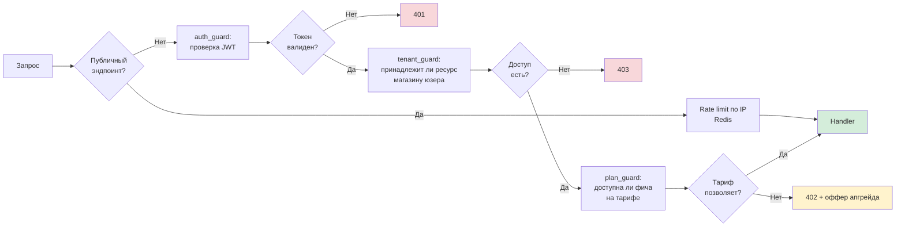

**Модель токенов:**

| Токен | Живёт | Где хранится | Назначение |
|---|---|---|---|
| Access JWT | 15 мин | память фронта | Доступ к API |
| Refresh JWT | 30 дней | httpOnly cookie | Обновление access |
| Purchase token | 30 дней | ссылка в email | Доступ покупателя к купленному без регистрации |
| Webhook signature | — | — | HMAC-проверка входящих от платёжки |

**Purchase token — важная деталь.** Покупатель не регистрируется. После оплаты он получает подписанную ссылку на страницу доставки. Это сохраняет конверсию и одновременно защищает контент.

---

## 12. Модель данных

### 12.1. ER-диаграмма

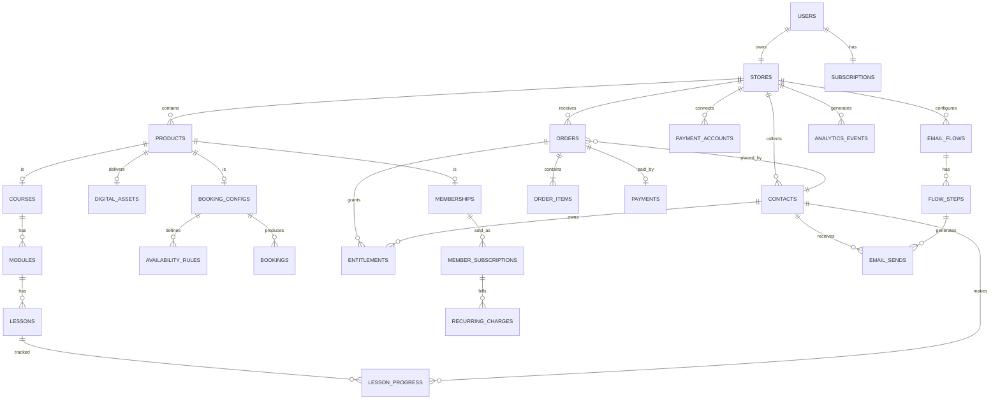

### 12.2. Ключевые таблицы (комментарии по проектированию)

**`stores`** — центральная сущность мультитенантности.

| Поле | Тип | Заметка |
|---|---|---|
| `id` | uuid | |
| `user_id` | uuid FK | |
| `slug` | varchar UNIQUE | **это и есть URL.** Индекс критичен |
| `title`, `bio`, `avatar_url` | | |
| `theme` | jsonb | Настройки дизайна |
| `blocks_order` | jsonb | Порядок карточек на витрине |
| `is_published` | bool | |
| `published_snapshot` | jsonb | **Готовый JSON витрины для отдачи** |
| `snapshot_updated_at` | timestamptz | |

> **`published_snapshot` — ключевая оптимизация.** Витрина отдаётся одним запросом по `slug` из готового денормализованного JSON, без джойнов по продуктам. Пересобирается только при публикации изменений. Это разница между «выдержим 10M визитов» и «БД ляжет».

**`products`** — полиморфная таблица.

| Поле | Тип | Заметка |
|---|---|---|
| `id`, `store_id` | uuid | |
| `type` | enum | `digital` / `course` / `booking` / `membership` / `lead_magnet` / `link` / `telegram_channel` |
| `title`, `description`, `cover_url` | | |
| `price_amount` | integer | **В копейках. Никогда не float** |
| `currency` | char(3) | |
| `pricing_mode` | enum | `fixed` / `pay_what_you_want` / `free` |
| `is_active`, `position` | | |
| `settings` | jsonb | Специфика типа |

**`orders`** — с обязательной идемпотентностью.

| Поле | Заметка |
|---|---|
| `idempotency_key` UNIQUE | Защита от двойного списания |
| `status` | `pending` → `paid` → `delivered` / `failed` / `refunded` |
| `total_amount`, `currency` | |
| `provider`, `provider_payment_id` | |
| `contact_id` | покупатель |

**`entitlements`** — что именно куплено и до какого момента доступно. Отдельная таблица, потому что доступ может быть выдан не только покупкой (промо, ручная выдача, возврат доступа).

| Поле | Заметка |
|---|---|
| `contact_id`, `product_id` | |
| `granted_at`, `expires_at` | `expires_at = NULL` для бессрочных |
| `source` | `purchase` / `manual` / `promo` |
| `revoked_at` | Для отзыва при возврате или неоплате подписки |

**`analytics_events`** — партиционировать по дате с самого начала. Растёт быстрее всего.

### 12.3. Мультитенантность

Все запросы фильтруются по `store_id`. Дополнительно рекомендуется **PostgreSQL Row Level Security** — это защита от логических ошибок, когда разработчик забыл фильтр. В SaaS утечка данных между тенантами — фатальный инцидент, дублирующая защита себя окупает.

---

## 13. Событийная модель (Kafka)

### 13.1. Честное предупреждение

> **Kafka для MVP этого продукта избыточна.** До нескольких тысяч заказов в день с той же задачей справится Redis Streams или ARQ/Celery, при этом инфраструктура будет в разы проще и дешевле в эксплуатации.
>
> Kafka оправдана, если: (а) вы точно планируете аналитический поток на миллионы событий, (б) команда уже умеет её эксплуатировать, (в) закладываетесь на разделение на сервисы.
>
> Ниже — дизайн под Kafka, как в требованиях. **Практический совет: спроектируйте абстракцию `EventBus` с двумя реализациями** (Redis Streams для старта, Kafka для масштаба). Это буквально сутки работы и снимает риск выбора.

### 13.2. Топики

| Топик | Партиционирование | Продюсер | Консьюмеры |
|---|---|---|---|
| `order.events` | `store_id` | OrderService | delivery, analytics, telegram |
| `payment.events` | `order_id` | PaymentService / webhooks | delivery, billing, analytics |
| `contact.events` | `store_id` | OrderService, LeadService | flow-worker, analytics |
| `email.events` | `store_id` | flow-worker, EmailService | email-worker |
| `analytics.events` | `store_id` | public router | analytics-worker |
| `booking.events` | `store_id` | BookingService | email, telegram, calendar |
| `subscription.events` | `store_id` | SubscriptionService | delivery, billing |

**Партиционирование по `store_id`** гарантирует порядок событий в рамках одного магазина — этого достаточно, глобальный порядок не нужен.

### 13.3. Схема события

```json
{
  "event_id": "uuid",
  "event_type": "order.paid",
  "version": 1,
  "occurred_at": "2026-07-31T12:00:00Z",
  "store_id": "uuid",
  "correlation_id": "uuid",
  "idempotency_key": "string",
  "payload": {
    "order_id": "uuid",
    "contact_id": "uuid",
    "items": [{ "product_id": "uuid", "type": "digital", "amount": 199000 }],
    "total_amount": 199000,
    "currency": "RUB",
    "provider": "yookassa"
  }
}
```

**Обязательные поля:** `event_id` и `idempotency_key` — все консьюмеры должны быть идемпотентны. Kafka гарантирует at-least-once, значит дубли будут. Хранить обработанные `event_id` в Redis с TTL.

### 13.4. Поток события покупки

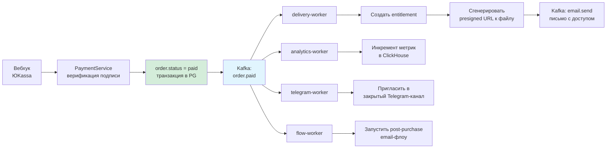

---

## 14. Ключевые сценарии (sequence-диаграммы)

### 14.1. Покупка цифрового товара

```mermaid
sequenceDiagram
    autonumber
    participant B as Покупатель
    participant W as Витрина<br/>React
    participant API as FastAPI
    participant PG as PostgreSQL
    participant PAY as ЮKassa
    participant K as Kafka
    participant WK as delivery-worker
    participant S3 as S3

    B->>W: Открывает stan-clone.ru/anna
    W->>API: GET /public/stores/anna
    API->>API: Проверка Redis-кэша
    API-->>W: published_snapshot (JSON)
    W-->>B: Витрина отрисована за 200мс

    B->>W: Тап на «Гайд по Reels — 1990 ₽»
    W->>API: POST /checkout/init {product_id, email, idempotency_key}
    API->>PG: INSERT order (status=pending)
    API->>PAY: Создать платёж
    PAY-->>API: confirmation_url + payment_id
    API->>PG: UPDATE order.provider_payment_id
    API-->>W: {confirmation_url}
    W-->>B: Виджет оплаты: СБП / карта

    B->>PAY: Оплачивает через СБП
    PAY->>API: POST /webhooks/yookassa (payment.succeeded)
    API->>API: Проверка HMAC-подписи
    API->>PG: BEGIN; order.status=paid; COMMIT
    API->>K: publish order.paid
    API-->>PAY: 200 OK

    K->>WK: consume order.paid
    WK->>PG: INSERT entitlement
    WK->>S3: Сгенерировать presigned URL (TTL 7 дней)
    WK->>K: publish email.send {template: delivery}
    WK->>PG: order.status=delivered

    PAY-->>B: Редирект на /thanks?token=...
    B->>API: GET /public/delivery?token=...
    API->>API: Проверка purchase token
    API-->>B: Страница со ссылкой на файл
```

**Критические детали этого флоу:**

1. **Идемпотентность на `/checkout/init`** — двойной тап по кнопке не должен создавать два заказа.
2. **Вебхук — источник истины, не редирект.** Пользователь может закрыть браузер после оплаты. Статус меняется только по вебхуку.
3. **Проверка HMAC-подписи обязательна.** Без неё любой может отправить фейковый «оплачено».
4. **Ответ `200 OK` вебхуку — сразу,** до тяжёлой работы. Иначе платёжка будет ретраить.
5. **Presigned URL с TTL,** а не прямая ссылка на файл. Иначе ссылку расшарят и товар растечётся.

### 14.2. Бронирование звонка

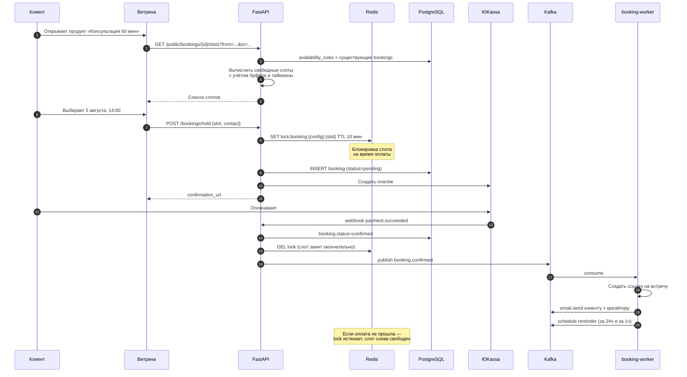

**Ключевая деталь — Redis-блокировка слота.** Без неё два человека оплатят один слот, и вы получите скандал. Блокировка на время оплаты с автоистечением решает проблему без сложных транзакций.

### 14.3. Email-флоу (автоматизация)

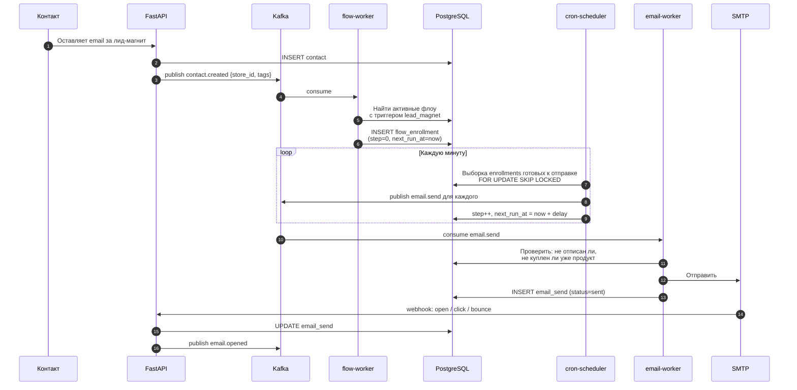

**`FOR UPDATE SKIP LOCKED`** — обязательный паттерн. Позволяет запускать несколько экземпляров cron-планировщика без дублей отправки.

**Проверка перед отправкой** («не купил ли уже») критична: ничто не бесит клиента сильнее, чем письмо «купи наконец» после того, как он купил.

---

## 15. Redis: где и зачем

| Задача | Ключ | TTL | Комментарий |
|---|---|---|---|
| **Кэш витрины** | `store:snapshot:{slug}` | 5 мин + инвалидация при публикации | Самое важное применение. Снимает 95% нагрузки с БД |
| **Rate limiting** | `rl:{ip}:{endpoint}` | 60 сек | Защита публичных эндпоинтов |
| **Блокировка слота** | `lock:booking:{cfg}:{slot}` | 10 мин | Предотвращение двойного бронирования |
| **Идемпотентность** | `idem:{key}` | 24 ч | Защита от дублей заказов |
| **Дедупликация событий** | `evt:{event_id}` | 24 ч | Идемпотентность консьюмеров |
| **Сессии / refresh-токены** | `sess:{user_id}:{jti}` | 30 дней | Возможность отзыва |
| **Счётчики аналитики** | `stat:{store_id}:{date}` | 24 ч | Буфер перед сбросом в БД |
| **Прогрев OTP / magic link** | `otp:{email}` | 10 мин | |

**Про инвалидацию кэша витрины:** при сохранении изменений в дашборде — пересобрать `published_snapshot` в БД и удалить ключ Redis. Не полагайтесь только на TTL: криэйтор изменил цену и ждёт, что она сразу видна.

---

## 16. Контракты: Zod + DTO

### 16.1. Принцип: единый источник истины

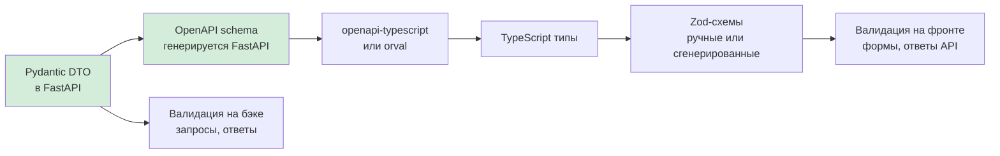

**Практическая схема:** FastAPI автоматически генерирует OpenAPI из Pydantic-моделей. Из OpenAPI генерируем TypeScript-типы. Zod-схемы пишем поверх для рантайм-валидации форм и ответов.

Валидация должна быть в обоих местах. Zod на фронте — для UX (мгновенная обратная связь в форме). Pydantic на бэке — для безопасности. Никогда не доверять фронтенду.

### 16.2. Пример контракта — создание продукта

**Pydantic (backend):**

```python
from pydantic import BaseModel, Field, field_validator
from typing import Literal
from uuid import UUID

class ProductCreateDTO(BaseModel):
    type: Literal["digital", "course", "booking", "membership",
                  "lead_magnet", "link", "telegram_channel"]
    title: str = Field(min_length=1, max_length=120)
    description: str | None = Field(default=None, max_length=2000)
    price_amount: int = Field(ge=0, le=100_000_000)  # копейки
    currency: Literal["RUB", "KZT", "BYN"] = "RUB"
    pricing_mode: Literal["fixed", "pay_what_you_want", "free"] = "fixed"
    cover_url: str | None = None
    settings: dict = Field(default_factory=dict)

    @field_validator("price_amount")
    @classmethod
    def check_price_vs_mode(cls, v, info):
        mode = info.data.get("pricing_mode")
        if mode == "free" and v != 0:
            raise ValueError("Бесплатный продукт не может иметь цену")
        if mode == "fixed" and v == 0:
            raise ValueError("Укажите цену или выберите режим «бесплатно»")
        return v


class ProductResponseDTO(BaseModel):
    id: UUID
    store_id: UUID
    type: str
    title: str
    description: str | None
    price_amount: int
    currency: str
    is_active: bool
    position: int

    model_config = {"from_attributes": True}
```

**Zod (frontend):**

```typescript
import { z } from "zod";

export const ProductTypeSchema = z.enum([
  "digital", "course", "booking", "membership",
  "lead_magnet", "link", "telegram_channel",
]);

export const ProductCreateSchema = z.object({
  type: ProductTypeSchema,
  title: z.string().min(1, "Введите название").max(120),
  description: z.string().max(2000).nullable().optional(),
  price_amount: z.number().int().min(0).max(100_000_000),
  currency: z.enum(["RUB", "KZT", "BYN"]).default("RUB"),
  pricing_mode: z.enum(["fixed", "pay_what_you_want", "free"]).default("fixed"),
  cover_url: z.string().url().nullable().optional(),
  settings: z.record(z.unknown()).default({}),
}).refine(
  (d) => !(d.pricing_mode === "free" && d.price_amount !== 0),
  { message: "Бесплатный продукт не может иметь цену", path: ["price_amount"] }
).refine(
  (d) => !(d.pricing_mode === "fixed" && d.price_amount === 0),
  { message: "Укажите цену или выберите режим «бесплатно»", path: ["price_amount"] }
);

export type ProductCreate = z.infer<typeof ProductCreateSchema>;
```

> **Правило:** любое бизнес-правило, влияющее на деньги или доступ, дублируется в обеих схемах. Правила чисто про UX (например, подсказка длины) могут жить только в Zod.

### 16.3. Деньги — отдельно

**Всегда `integer` в минимальных единицах (копейки). Никогда `float`.** `0.1 + 0.2 != 0.3` — в финансовом продукте это не философия, а реальные расхождения в отчётах.

Форматирование в рубли — только на слое отображения.

---

## 17. Инфраструктура и Docker

### 17.1. Compose-схема

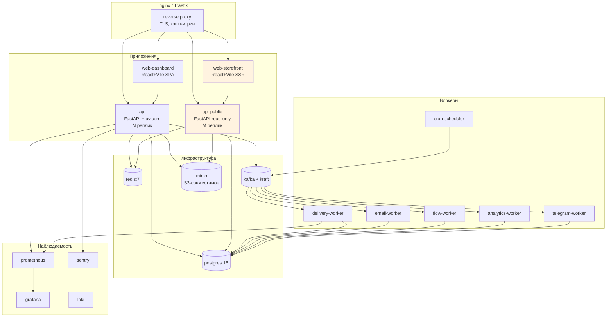

**Обратите внимание на разделение `api` и `api-public`.** Публичный контур витрин — отдельный сервис, только на чтение, масштабируется независимо и не может уронить дашборд. Это следствие разницы профилей нагрузки из раздела 10.2.

### 17.2. docker-compose.yml (скелет)

```yaml
services:
  postgres:
    image: postgres:16-alpine
    environment:
      POSTGRES_DB: creatorstore
      POSTGRES_PASSWORD: ${PG_PASSWORD}
    volumes: [pgdata:/var/lib/postgresql/data]
    healthcheck:
      test: ["CMD-SHELL", "pg_isready -U postgres"]
      interval: 5s

  redis:
    image: redis:7-alpine
    command: redis-server --appendonly yes --maxmemory 512mb --maxmemory-policy allkeys-lru
    volumes: [redisdata:/data]

  kafka:
    image: bitnami/kafka:3.7
    environment:
      KAFKA_CFG_NODE_ID: 0
      KAFKA_CFG_PROCESS_ROLES: controller,broker
      KAFKA_CFG_LISTENERS: PLAINTEXT://:9092,CONTROLLER://:9093
      KAFKA_CFG_CONTROLLER_QUORUM_VOTERS: 0@kafka:9093
    volumes: [kafkadata:/bitnami/kafka]

  minio:
    image: minio/minio
    command: server /data --console-address ":9001"
    environment:
      MINIO_ROOT_USER: ${MINIO_USER}
      MINIO_ROOT_PASSWORD: ${MINIO_PASSWORD}
    volumes: [miniodata:/data]

  api:
    build: ./backend
    command: uvicorn app.main:app --host 0.0.0.0 --port 8000 --workers 4
    env_file: .env
    depends_on:
      postgres: {condition: service_healthy}
      redis: {condition: service_started}
    deploy:
      replicas: 2

  api-public:
    build: ./backend
    command: uvicorn app.main_public:app --host 0.0.0.0 --port 8001 --workers 8
    env_file: .env
    environment:
      READ_ONLY: "true"
    deploy:
      replicas: 4

  delivery-worker:
    build: ./backend
    command: python -m workers.delivery_worker
    env_file: .env

  email-worker:
    build: ./backend
    command: python -m workers.email_worker
    env_file: .env

  flow-worker:
    build: ./backend
    command: python -m workers.flow_worker
    env_file: .env

  cron-scheduler:
    build: ./backend
    command: python -m workers.cron_scheduler
    env_file: .env

  web-storefront:
    build: ./frontend/storefront
    environment:
      VITE_API_URL: http://api-public:8001

  web-dashboard:
    build: ./frontend/dashboard
    environment:
      VITE_API_URL: http://api:8000

  nginx:
    image: nginx:alpine
    ports: ["80:80", "443:443"]
    volumes:
      - ./docker/nginx.conf:/etc/nginx/nginx.conf:ro
    depends_on: [api, api-public, web-storefront, web-dashboard]

volumes:
  pgdata:
  redisdata:
  kafkadata:
  miniodata:
```

### 17.3. Cron-задачи

| Задача | Частота | Что делает |
|---|---|---|
| `process_email_flows` | 1 мин | Выборка enrollments, готовых к следующему шагу |
| `charge_recurring` | 1 час | Списание по подпискам membership |
| `revoke_expired_entitlements` | 1 час | Отзыв доступа при неоплате |
| `send_booking_reminders` | 15 мин | Напоминания за 24ч и 1ч |
| `aggregate_analytics` | 10 мин | Сброс счётчиков Redis → БД |
| `rebuild_stale_snapshots` | 1 час | Пересборка витрин при рассинхроне |
| `retry_failed_deliveries` | 30 мин | Повтор неудавшихся выдач доступа |
| `cleanup_expired_locks` | 5 мин | Подчистка зависших блокировок |
| `sync_telegram_members` | 6 час | Сверка доступов в закрытых каналах |

---

## 18. Roadmap: от нуля до первых платящих

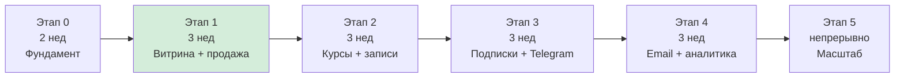

| Этап | Что делаем | Критерий готовности |
|---|---|---|
| **0. Фундамент** | Auth, магазины, БД, Docker, CI | Юзер регистрируется и видит пустой дашборд |
| **1. Витрина + цифровой товар** | Конструктор витрины, товар-файл, чекаут ЮKassa/СБП, доставка | **Реальный человек купил файл и получил его** |
| **2. Курсы + бронирование** | Модули/уроки, прогресс, календарь, слоты | Продана консультация со слотом в календаре |
| **3. Подписки + Telegram** | Рекуррент, автовыдача доступа в закрытый канал | Работает автосписание и автоотзыв доступа |
| **4. Email + аналитика** | Контакты, лид-магниты, флоу, дашборд метрик | Флоу из 5 писем отработал end-to-end |
| **5. Масштаб** | Кэш, CDN, партиционирование, промокоды, upsell, партнёрка | Держим нагрузку, растёт ARPU |

> **Этап 1 — самый важный.** Всё остальное можно откладывать. Продукт, в котором криэйтор может продать файл за 15 минут, уже имеет право на существование. Продукт с курсами, но без работающей оплаты — нет.

---

## 19. Риски и честные предупреждения

### 19.1. Технические

| Риск | Митигация |
|---|---|
| **Двойное списание** | Идемпотентные ключи на всех платёжных операциях, UNIQUE-констрейнт в БД |
| **Потеря вебхука** | Периодическая сверка статусов с провайдером (reconciliation job) |
| **Утечка файлов** | Presigned URL с коротким TTL, вотермарки для PDF, лимит скачиваний |
| **Двойное бронирование** | Redis-локи + UNIQUE-констрейнт на (config_id, slot_start) |
| **Кросс-тенантная утечка** | Row Level Security + обязательный `store_id` во всех репозиториях |
| **Падение витрин под нагрузкой** | Отдельный read-only контур, snapshot-кэш, CDN |
| **Рассылки уходят в спам** | SPF/DKIM/DMARC с первого дня, прогрев домена, отдельный поддомен для транзакционных писем |

### 19.2. Продуктовые

| Риск | Комментарий |
|---|---|
| **Курица и яйцо** | Без криэйторов нет витрин, без витрин нет вирусной петли. Первые 100 криэйторов придётся привлекать вручную |
| **Копирование фич не копирует бренд** | Stan выигрывает узнаваемостью формата. Клон должен выигрывать чем-то другим — Telegram, ценой, локальными платежами |
| **Низкий ARPU** | При $29–35 нужны десятки тысяч клиентов для значимой выручки. Или другая ценовая модель |
| **Высокий отток на старте** | Криэйтор без первой продажи уходит. Онбординг важнее функционала |

### 19.3. Юридические

| Риск | Комментарий |
|---|---|
| **Схема платежей** | Обязательно проверить с юристом до разработки. Разница между вариантами А и Б — месяцы работы |
| **54-ФЗ и фискализация** | Зависит от выбранной схемы. В варианте А ответственность на криэйторе |
| **152-ФЗ, персональные данные** | Хранение данных на серверах в РФ, политика конфиденциальности, согласия |
| **Контент пользователей** | Нужна модерация и процедура реагирования на жалобы — иначе платформа станет площадкой для скама |
| **Возвраты** | Закон о защите прав потребителей применительно к цифровым товарам — прописать оферту заранее |

> **Замечание про копирование:** воспроизводить бизнес-модель, набор функций и архитектурные решения — законно и нормально. Копировать дизайн, тексты, товарные знаки и графику — нет. Делайте свой визуал и свои тексты.

---

## Приложение: чеклист паритета функций

| Функция Stan | Приоритет для клона | Этап |
|---|---|---|
| Витрина link-in-bio | 🔴 Критично | 1 |
| Цифровые товары | 🔴 Критично | 1 |
| Чекаут без регистрации | 🔴 Критично | 1 |
| Мгновенная доставка | 🔴 Критично | 1 |
| Конструктор курсов | 🟠 Высокий | 2 |
| Бронирование звонков | 🟠 Высокий | 2 |
| Подписки | 🟠 Высокий | 3 |
| Лид-магниты | 🟠 Высокий | 4 |
| Email-флоу | 🟠 Высокий | 4 |
| Аналитика | 🟠 Высокий | 4 |
| Промокоды | 🟡 Средний | 5 |
| Order bumps / upsells | 🟡 Средний | 5 |
| Партнёрская программа | 🟡 Средний | 5 |
| Пиксели рекламных систем | 🟡 Средний | 5 |
| Сообщество | 🟢 Низкий | 5+ |
| **Telegram-каналы** ⭐ | 🔴 Дифференциатор | 3 |
| **Кастомный домен** ⭐ | 🟠 Дифференциатор | 5 |
| **СБП по умолчанию** ⭐ | 🔴 Дифференциатор | 1 |
| **Email на базовом тарифе** ⭐ | 🟠 Дифференциатор | 4 |

⭐ — то, чего у Stan нет или сделано плохо. Это ваши аргументы.

---

## Источники

- stan.store — официальный сайт, страница тарифов, блог
- help.stan.store — база знаний, сравнение тарифов
- trustmrr.com/startup/stan — верифицированные метрики выручки
- SimilarWeb, Semrush — данные о трафике (май–август 2026)
- Независимые обзоры: kourses.com, talkspresso.com, bloggingx.com, livingabstracts.com, creatorstackclub.com, group.app, ecomm.design

**Оговорка:** тарифы и функции меняются. Перед принятием решений проверяйте актуальные данные на stan.store. Разделы 9–19 — инженерный и продуктовый дизайн клона, а не описание того, как устроен Stan.
